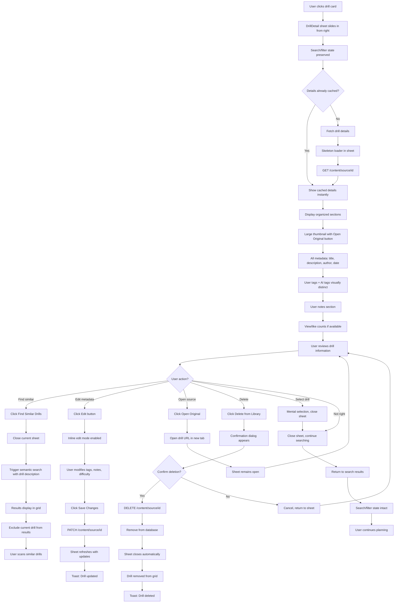

# UX Design Specification Coaching-content-library

**Author:** Kohl
**Date:** 2026-01-08

---

<!-- UX design content will be appended sequentially through collaborative workflow steps -->

## Executive Summary

### Project Vision

Coaching-content-library is an AI-powered content management system that solves the critical retrieval problem in goalie coaching content discovery. While social media platforms (TikTok, Instagram, YouTube) excel at surfacing valuable drill content, they fail catastrophically at helping coaches use that content when actually needed—saved posts become buried in mixed collections, and keyword search returns irrelevant results because it doesn't understand position-specific coaching nuances.

The system transforms lesson planning from a 30-60 minute hunt through scattered collections into a 15-30 minute focused design session by providing instant access to contextually relevant drills through semantic search, AI-powered auto-tagging, and intelligent recommendations.

**Core Value Proposition:** "I know I saved a perfect drill for this" → finds it in 30 seconds → picks with confidence → moves on to lesson structure design.

### Target Users

#### Primary User: Kohl - The Pragmatic Goalie Coach

**Profile:**
- 5-year private goalie coach running 2-3 sessions per week
- Works with individual goalies or small groups (3-4 goalies)
- Tech-comfortable, values thoughtfully designed tools
- Each lesson requires 30-60 minutes of planning (currently)

**Pain Points:**
- **Limited variety:** Reuses familiar drills because finding new ones takes too long
- **Time waste:** Excessive time hunting through scattered collections across multiple apps
- **Confidence gap:** Wonders if there's a better drill option but can't afford the search time
- **Group drill struggle:** Particularly challenged by keeping 3-4 goalies simultaneously engaged

**Success Criteria:**
- Planning time reduced to 15-30 minutes
- Access to drill variety beyond what can be recalled
- Confidence in using the best available drill for each situation
- Tool used for every lesson plan (2-3x per week)

#### Secondary User: Sarah Chen - AI Product Engineer (Portfolio Evaluator)

**Profile:**
- Senior AI engineer at 50-person SaaS company
- Evaluates portfolio projects for practical AI integration, clean architecture, and completeness

**Evaluation Criteria:**
- Problem-solution fit: Does this solve a real problem?
- Appropriate AI technique selection: Semantic search for retrieval, LLM for tagging
- Clean, maintainable code architecture
- Complete MVP showing follow-through (not 30% done across 10 features)
- Evidence the solution will actually be used

**Success Signal:** "This person understands how to integrate AI practically into products. They'd fit well on our team."

### Key Design Challenges

**1. Information Density vs. Scannability**

The system manages rich drill metadata through progressive disclosure: drill cards in the grid view show minimal, scannable information (thumbnail, title, source icon, difficulty badge, 1-2 key tags) optimized for fast visual scanning. Full metadata (description, all tags, difficulty, age group, equipment, statistics) appears only when users click to view drill details in the expandable sheet/modal.

**Design Decision:** Grid view prioritizes speed and scannability over completeness. Detail view provides comprehensive information when users signal interest by clicking. This approach addresses both coaching use (fast scanning) and portfolio presentation (polished, uncluttered interface).

**Design Tension:** Which 1-2 tags to show on cards? How to indicate "more information available" without cluttering?

**2. Search + Filter Coordination**

Semantic search (natural language queries like "drills for getting back up quickly") and traditional filters (difficulty dropdowns, tag selections) must work harmoniously together. Users need to understand when to search vs. filter, and how they combine. Mobile screens add constraint: filters must be accessible but not dominate limited space.

**Design Tension:** Should filters clear search results? Should search results be filterable? How to communicate this relationship?

**3. AI Feature Transparency**

Auto-generated tags, semantic search results, and similar drill recommendations all use AI behind the scenes. Users need to trust AI suggestions while maintaining control. Critical distinction: user-provided tags vs. AI-generated tags must be visually clear and AI tags must be removable.

**Design Tension:** How to show AI is helpful without making users feel they're losing control? How to build trust in semantic search when results don't match keywords?

### Design Opportunities

**1. Visual Drill Discovery**

Thumbnails combined with source icons (YouTube red, Reddit orange, Instagram pink, TikTok black) and difficulty badges (beginner green, intermediate amber, advanced red) create instant visual recognition patterns. The hockey-themed design (deep blue #1e3a5f primary, ice blue #38bdf8 accent) creates emotional connection and professional polish that distinguishes this from generic CRUD interfaces.

**Opportunity:** Visual design becomes a competitive advantage for portfolio presentation while improving drill recognition speed for coaching use.

**2. Progressive Disclosure**

The natural exploration flow—grid view → drill detail sheet → similar drill recommendations—enables users to discover related approaches they didn't know existed. "Similar Drills" feature exposes drill variety without requiring additional search effort. Minimal drill cards keep the grid scannable while comprehensive detail views satisfy deeper information needs.

**Opportunity:** "I came for one drill, discovered three related approaches" becomes a delightful moment that increases coaching effectiveness and demonstrates thoughtful UX design. The card-to-detail progression creates a clear information hierarchy.

**3. Mobile-First Coaching Workflow**

Coaches may plan on phone during breaks, commutes, or between sessions. Touch-optimized interface with thumb-friendly filter toggles and responsive drill grid (1 column mobile → 2 columns tablet → 3-4 columns desktop) ensures the tool works wherever planning happens.

**Opportunity:** Mobile-first responsive design demonstrates modern UX thinking while solving real coaching workflow constraints.

## Core User Experience

### Defining Experience

The core experience of Coaching-content-library centers on **effortless drill retrieval during lesson planning**. The most frequent user action is searching or browsing the drill library during 2-3 weekly lesson planning sessions, following the pattern: "I need a drill for X skill" → semantic search or filter → scan results → click for details → pick the right drill.

**The Critical Interaction:** Semantic search returning contextually relevant results is absolutely critical to get right. When users type "drills for getting back up quickly" and see relevant butterfly recovery drills (even without exact keyword matches), they experience the trust-building moment: "This understands what I meant." If this interaction fails, users lose trust and revert to "winging it" with familiar drills.

**The Core Loop:**
1. Identify skill need for upcoming lesson
2. Search naturally or apply filters
3. Visually scan grid of drill cards
4. Click promising drills for full details
5. Review similar drill recommendations
6. Select the right drill with confidence

This loop must be fast (15-30 minutes total planning time, down from 30-60 minutes) and confidence-building (user believes they're using the best available drill, not just the one they remembered).

### Platform Strategy

**Platform:** Web Application (React SPA)

**Responsive Design Strategy:**
- Mobile-first approach with three breakpoints:
  - **Mobile (<768px):** 1-column drill grid, collapsible filters, full-screen detail sheets
  - **Tablet (768-1024px):** 2-column drill grid, accessible filters, drawer detail view
  - **Desktop (>1024px):** 3-4 column drill grid, persistent filters, side panel detail view

**Target Browsers:** Modern evergreen browsers only (Chrome, Firefox, Safari, Edge latest versions) - no legacy browser support required

**Input Methods:**
- **Mobile/Tablet:** Touch-based interactions with thumb-friendly filter toggles, tap to open drill detail sheets, swipe-friendly grid
- **Desktop:** Mouse/keyboard with hover states, keyboard navigation for interactive elements, click-based interactions

**Platform Considerations:**
- Discord bot integration complete (separate capture workflow, outside web UI)
- No real-time sync required (drills appear on next page load/refresh)
- No offline functionality needed (planning happens with internet access)
- No native mobile app (responsive web covers mobile workflow)

**Performance Requirements:**
- Initial page load: <3 seconds on broadband
- Semantic search response: <2 seconds for typical queries
- Filter application: <500ms (real-time feel)
- Drill detail view: Instant client-side navigation

**Platform Decision Rationale:** Web-first platform with progressive enhancement for mobile enables coaches to plan wherever they are (phone during breaks/commutes, desktop at home) without maintaining separate codebases. Responsive design ensures full functionality across devices while optimizing each screen size.

### Effortless Interactions

**1. Content Capture** ✅ (Already Achieved)
- Copy URL from social media → paste to Discord bot → answer quick questions → saved to library
- Zero friction at the moment of discovery
- Capture workflow proven and working

**2. Semantic Search Understanding**
- Type natural language queries without keyword guessing
- "Getting back up quickly" finds butterfly recovery drills automatically
- Search understands coaching intent, not just literal text matching
- Results appear within 2 seconds

**3. Visual Drill Recognition**
- Thumbnails + source icons + difficulty badges = instant visual pattern recognition
- Familiar drills spotted in grid without reading titles
- Color coding (difficulty, source) enables fast scanning

**4. Real-Time Filtering**
- Filter application completes in <500ms (feels instant)
- Combinable filters without complex UI (simple dropdowns)
- Clear active filter state (users always know what's applied)
- Easy filter clearing

**5. Instant Drill Detail Access**
- Click any drill card → detail sheet opens immediately
- All comprehensive metadata available without additional navigation
- Similar drill recommendations visible in same view
- Edit/delete actions accessible

**Friction Eliminated:**
- No account creation or login (personal tool)
- No manual tag exhaustion (AI augments automatically)
- No complex filter builder interfaces
- No multi-step navigation to reach information

### Critical Success Moments

**1. First Semantic Search Success** (Trust-Building Moment)
- **When:** User types first natural language query
- **Success:** Relevant results appear that match intent, not just keywords
- **User Thinks:** "This understands what I meant"
- **Failure Impact:** User loses trust, reverts to keyword guessing or gives up entirely
- **Why Critical:** Determines if tool becomes default planning workflow or gets abandoned

**2. Discovering Similar Drills** (Delight Moment)
- **When:** User clicks drill detail to see "Similar Drills" recommendations
- **Success:** Discovers drill approaches they hadn't considered
- **User Thinks:** "I came for one drill, leaving with three related options"
- **Failure Impact:** Missed opportunity to expand drill variety and creative lesson design
- **Why Critical:** Creates "this is better than just searching" realization

**3. Fast Grid Scanning** (Speed Moment)
- **When:** User opens library or sees search results
- **Success:** Spots promising drills within seconds through visual scanning
- **User Thinks:** "I can see what I need immediately"
- **Failure Impact:** Time waste reading through cards, slower planning sessions
- **Why Critical:** Directly impacts 15-30 minute planning time target

**4. AI Tag Augmentation Validation** (AI Trust Moment)
- **When:** User sees AI-generated tags alongside their manual tags
- **Success:** AI suggestions make sense and add perspectives user didn't think to tag
- **User Thinks:** "Yes, those additional angles are helpful - I wouldn't have tagged those"
- **Failure Impact:** User loses trust in AI features, removes suggestions, ignores future AI help
- **Why Critical:** Establishes that AI enhances coach expertise rather than replacing it

**5. Mobile Filter Access** (Workflow Moment)
- **When:** User needs to filter library on phone during commute or break
- **Success:** Filters accessible but not dominating screen, easy to apply and dismiss
- **User Thinks:** "I can do my full planning workflow on my phone"
- **Failure Impact:** Planning constrained to desktop, reduced tool usage
- **Why Critical:** Enables planning whenever/wherever inspiration strikes

### Experience Principles

**1. Speed Over Features**

Every interaction optimized for "find and move on" rather than comprehensive functionality. Fast visual scanning beats detailed card information. Instant filter application (<500ms) beats powerful query builders. Quick semantic search (<2s) beats advanced search syntax. Planning sessions measured in minutes, not features used.

**Implication:** When choosing between adding information to drill cards vs. keeping them scannable, choose scannability. When choosing between filter complexity vs. speed, choose speed.

**2. Coach Expertise First, AI Augmentation Second**

User-provided tags, descriptions, and metadata are sacred and permanent. AI suggests additional perspectives and catches aspects coaches didn't think to tag, but never replaces coach knowledge. Visual distinction between user content and AI suggestions maintains clear authorship. Easy removal of AI suggestions that don't fit preserves coach control.

**Implication:** All AI features must demonstrate they're helping, not overriding. User content always takes precedence. Transparency in what's AI-generated vs. user-created.

**3. Progressive Disclosure**

Minimal drill cards keep grid scannable (thumbnail, title, source icon, difficulty badge, 1-2 key tags). Comprehensive detail view provides all metadata when users signal interest by clicking. "Similar Drills" recommendations expose variety without requiring search effort. Clear information hierarchy guides users from scanning → exploring → deciding.

**Implication:** Don't cram all metadata into cards. Trust users to click for details when interested. Optimize for the scan-first workflow.

**4. Trust Through Transparency**

Semantic search demonstrates understanding through relevant results, not through explaining algorithms. AI features show helpfulness through useful suggestions, not through claiming intelligence. No hidden algorithms or unexplained recommendations. Users always understand why they're seeing what they're seeing.

**Implication:** Show results, don't explain how. Let quality speak for itself. Make AI-generated content visually distinct and removable.

**5. Mobile-First, Responsive Everywhere**

Planning happens on phone (during breaks/commutes), tablet (on couch), or desktop (at desk). Touch-optimized interactions on mobile, mouse-optimized on desktop. Responsive grid (1→2→3-4 columns) adapts to any screen without losing functionality. Every feature accessible on every device, just adapted to screen size and input method.

**Implication:** Design for mobile first, enhance for desktop. No "desktop-only" features. Touch targets must be thumb-friendly. Filters must work on small screens.

## Desired Emotional Response

### Primary Emotional Goals

**Confidence** is the central emotional target for Coaching-content-library. Users should feel confident in their drill selection decisions, knowing they're using the best available drill for each situation rather than just the one they happened to remember. This confidence frees up mental energy for creative lesson design rather than second-guessing content choices.

**Supporting Emotions:**
- **Trust** - The tool understands coaching context and provides relevant results consistently
- **Empowerment** - AI augments coach expertise rather than replacing it
- **Efficiency** - Planning feels productive and focused, not rushed or incomplete
- **Discovery** - Finding related drills creates delightful "I hadn't thought of that" moments

**Emotions to Avoid:**
- **Doubt** - "Did I miss a better option?"
- **Skepticism** - "Can AI really understand goalie coaching?"
- **Obsolescence** - "Is this replacing my expertise?"
- **Rushing** - "Am I cutting corners by planning so fast?"

### Emotional Journey Mapping

**First Discovery (Initial Use)**
- **Target Emotion:** Curious and hopeful
- **User Thinking:** "Maybe this will actually solve my planning problem"
- **Design Support:** Clean interface, clear value proposition, immediate usability
- **Avoid:** Overwhelming with features, AI hype language, complex onboarding

**During First Semantic Search (Trust-Building Moment)**
- **Target Emotion:** Surprised trust
- **User Thinking:** "Wait, it actually understood what I meant"
- **Design Support:** Relevant results appear quickly, match coaching intent not just keywords
- **Critical:** This moment determines if user continues or abandons tool

**Core Planning Session (Regular Use)**
- **Target Emotion:** Calm confidence
- **User Thinking:** "I'm scanning, finding options, making good decisions"
- **Design Support:** Fast visual scanning, clear information hierarchy, responsive interactions
- **Avoid:** Analysis paralysis, information overload, uncertainty about completeness

**After Selecting Drill (Task Completion)**
- **Target Emotion:** Energized and ready
- **User Thinking:** "Perfect, now I can focus on lesson structure"
- **Design Support:** Clear selection action, comprehensive detail view, similar drills shown
- **Success:** Mental energy freed for creative work, not content hunting

**Discovering Similar Drills (Delight Moment)**
- **Target Emotion:** Delighted discovery
- **User Thinking:** "Oh, I didn't even think about approaching it this way"
- **Design Support:** Similar drills feature, visual variety in recommendations
- **Outcome:** Confidence that library exposes variety beyond memory

**Returning for Next Session (Habit Formation)**
- **Target Emotion:** Reliable trust
- **User Thinking:** "This is my default tool now, not a backup"
- **Design Support:** Consistent performance, familiar patterns, proven results
- **Goal:** Tool becomes instinctive part of coaching workflow

### Micro-Emotions

**Confidence vs. Doubt**
- **Target:** Users feel confident in drill selection decisions
- **Risk:** Second-guessing whether there's a better option hidden in library
- **UX Support:** Similar drills feature shows "here's what else exists" - users see options, not blind spots
- **Critical:** Eliminate lingering "did I miss something?" feeling

**Trust vs. Skepticism**
- **Target:** Users trust semantic search and AI suggestions
- **Risk:** Skeptical that AI "understands" coaching nuances
- **UX Support:** Results speak for themselves - relevance builds trust without explaining algorithms
- **Critical:** First search experience determines trust trajectory

**Empowered vs. Obsolete**
- **Target:** Users feel AI makes them better coaches
- **Risk:** Fear that AI is replacing their expertise
- **UX Support:** User tags are sacred and displayed first; AI augments but never replaces
- **Critical:** Coach remains the expert, AI is the assistant

**Efficient vs. Rushed**
- **Target:** Users feel efficiently productive
- **Risk:** Feeling rushed or that they're cutting corners
- **UX Support:** Fast doesn't mean shallow - detail views provide depth when needed
- **Critical:** Speed enables thoroughness, doesn't sacrifice it

### Design Implications

**Building Confidence:**
- **Similar Drills Feature** → Eliminates "what am I missing?" doubt by showing related options proactively
- **Clear Visual Hierarchy** → Fast grid scanning reduces analysis paralysis
- **Comprehensive Detail View** → Users can verify complete information before deciding
- **Tag Visibility** → Seeing all drill aspects (user + AI tags) builds confidence in understanding

**Building Trust:**
- **Results Over Explanations** → Semantic search proves itself through relevant results, not marketing copy
- **Consistent Performance** → <2s search, <500ms filters build reliability expectation
- **Transparent AI** → Visual distinction between user content and AI suggestions maintains honesty
- **No Surprises** → Users always understand what's happening and why

**Enabling Empowerment:**
- **User Tags Sacred** → Never modified or removed by AI, always displayed first
- **Easy AI Tag Removal** → Simple X button maintains coach control
- **Coach Expertise Front** → User descriptions and tags take precedence visually
- **Augmentation Model** → AI adds perspective, doesn't override decisions

**Supporting Efficiency:**
- **Progressive Disclosure** → Minimal cards for speed, detailed views for depth
- **Real-Time Feedback** → Instant filter application prevents waiting anxiety
- **Single-Click Access** → Drill detail opens immediately, no navigation friction
- **Clear State** → Active filters visible, search terms shown, no hidden context

**Creating Discovery:**
- **Similar Drills Placement** → Shown in detail view when user is engaged, not forced
- **Visual Pattern Recognition** → Thumbnails + badges create "I know that drill" moments
- **Serendipitous Filtering** → Combining filters surfaces unexpected drill combinations
- **Variety Exposure** → Grid shows range of sources, difficulties, approaches

### Emotional Design Principles

**1. Confidence Through Transparency**

Every interaction reinforces "you're making the right decision" by showing complete context. Users never wonder "what am I missing?" because similar drills, comprehensive metadata, and clear search results provide full visibility into available options.

**Application:** Always show what else exists. Similar drills aren't hidden until requested - they're shown proactively when viewing details. Search results show count and variety, not just top matches.

**2. Trust Through Performance**

Semantic search, filters, and recommendations earn trust by working consistently and quickly. No explanations needed - quality speaks for itself. Results prove the AI understands coaching through relevance, not through marketing claims.

**Application:** Never explain "our advanced AI algorithm..." - just return relevant results within 2 seconds. Let users discover quality through use, not promises.

**3. Empowerment Through Control**

AI augments coach expertise, never replaces it. Clear visual distinction between user content and AI suggestions maintains coach authority. Easy removal of AI additions preserves final decision-making power.

**Application:** User tags shown first with distinct visual style. AI tags shown second with different color/icon and X removal button. Deletion confirmation for user content, instant removal for AI suggestions.

**4. Efficiency Without Rushing**

Fast interactions enable quick decisions, but progressive disclosure ensures depth is available when needed. Users feel efficiently productive, not that they're cutting corners or missing information.

**Application:** Minimize card content for fast scanning, but make detail view comprehensive. Filters apply instantly, but users can combine multiple filters for precision. Speed serves thoroughness.

**5. Delight Through Discovery**

Similar drill recommendations and visual browsing create moments of "I didn't know I saved that" and "I hadn't thought to approach it this way." Discovery feels serendipitous, not algorithmic.

**Application:** Similar drills use natural language ("Drills Like This"), not technical terms ("Recommendations Based On Similarity Score"). Variety in grid shows visual diversity (different sources, difficulties) encouraging exploration.

## UX Pattern Analysis & Inspiration

### Inspiring Products Analysis

**YouTube: Video Discovery at Scale**

YouTube excels at visual-first content discovery across massive scale. Key UX strengths include thumbnail-first card design (video recognition happens visually before reading titles), progressive information disclosure (minimal metadata on cards, full details in video page), consistent source attribution (channel icon/name always visible), and contextual recommendations that enable discovery flow. The search experience provides instant suggestions as users type, building confidence that the system understands intent. Theater mode and seamless navigation demonstrate polish in transitions and interactions.

**Application to Coaching-content-library:** Adopt thumbnail-first approach with adaptation for Instagram/TikTok constraints (color-coded placeholders maintain visual consistency). Source attribution pattern directly applicable with YouTube/Reddit/Instagram/TikTok icons. Progressive disclosure matches our card → detail sheet pattern. Related content pattern informs "Similar Drills" feature placement.

**Pinterest: Visual Browsing & Discovery**

Pinterest demonstrates excellence in visual content discovery through browsing rather than search-first patterns. Key UX strengths include masonry grid layout optimizing screen space while maintaining scannability, hover-revealed actions keeping cards clean, infinite scroll creating frictionless browsing, visual similarity recommendations enabling serendipitous discovery, and lightweight organization through boards without complex taxonomy. The "More like this" language feels natural rather than algorithmic.

**Application to Coaching-content-library:** Adopt hover interactions for edit/delete actions (desktop) and long-press (mobile). "More like this" language directly applicable as "Drills Like This." Visual browsing emphasis aligns with our grid-first design. However, adapt masonry layout to consistent card heights for more predictable scanning, and use "load more" pagination instead of infinite scroll to maintain performance with large libraries.

**Streaming Dashboards (Netflix/Disney+/Hulu): Content Discovery Across Scale**

Streaming platforms excel at content discovery across huge catalogs without overwhelming users. Key UX strengths include horizontal carousels organized by category ("Continue Watching", "Trending", "Because you watched X"), hero content featuring promoted items prominently, consistent card structure with thumbnail + minimal text, clear navigation patterns, and progress indicators building completion desire. Auto-play trailers on hover create engagement without commitment.

**Application to Coaching-content-library:** Adopt consistent card structure pattern (all drill cards use same template). Category-based organization informs filter structure (difficulty, age group, tags). However, adapt horizontal carousels to vertical grid with combinable filters - provides more user control and suits desktop/mobile better. Skip autoplay patterns to maintain user control principle. Consider optional "recently added" featured section but keep grid as primary pattern.

### Thumbnail Constraint Solution

**Challenge:** Instagram and TikTok APIs don't provide thumbnail access without business accounts or TOS violations. This affects 2 of 4 primary content sources.

**Solution: Source Icon + Color-Coded Placeholders**

Instead of treating missing thumbnails as a limitation, we turn source identification into a visual design feature:

- **YouTube/Reddit cards:** Display actual thumbnails extracted via APIs
- **Instagram cards:** Pink/purple gradient background with Instagram icon
- **TikTok cards:** Black background with cyan TikTok icon

**Benefits:**
- Maintains consistent card structure across all sources (critical for fast grid scanning)
- Source becomes immediately identifiable even without reading (stronger than subtle icons)
- Professional, intentional appearance (not "broken image" placeholders)
- Aligns with existing hockey-themed color system
- No TOS violations or additional capture friction

**Visual Pattern:** All cards maintain identical layout structure (image/placeholder area → title → author → tags → difficulty badge). Instagram/TikTok cards feature prominent brand-colored backgrounds with source icons that are instantly recognizable in grid view, turning the constraint into a design strength.

### Transferable UX Patterns

**Navigation & Information Architecture:**

1. **Thumbnail-First Visual Hierarchy** (YouTube, Pinterest, Streaming)
   - Visual recognition happens before text reading
   - Consistent card templates enable pattern recognition
   - Application: Drill cards lead with thumbnail/placeholder, minimal text for fast scanning

2. **Progressive Disclosure** (YouTube, Streaming)
   - Minimal information on cards, comprehensive details on click
   - Users control depth of engagement
   - Application: Grid cards show essentials (thumbnail, title, source, difficulty, 1-2 tags), detail view provides complete metadata

3. **Source Attribution Always Visible** (YouTube)
   - Builds trust and context
   - Enables quick source filtering visually
   - Application: Source icons with brand colors on every card, prominently placed

**Interaction Patterns:**

1. **Hover-Revealed Actions** (Pinterest)
   - Keep cards clean until interaction
   - Progressive disclosure of secondary actions
   - Application: Edit/delete buttons appear on hover (desktop) or long-press (mobile)

2. **Contextual Recommendations** (YouTube, Pinterest, Streaming)
   - "More like this" creates discovery without distraction
   - Shown when user engages, not forced
   - Application: "Similar Drills" appear in detail view when user clicks drill

3. **Real-Time Search Suggestions** (YouTube)
   - Builds confidence that system understands intent
   - Reduces cognitive load of perfect query formulation
   - Application: Search shows instant results as user types (semantic understanding, not just autocomplete)

**Visual Design Patterns:**

1. **Consistent Card Structure** (All three platforms)
   - Same template for all content types
   - Predictability enables faster scanning
   - Application: All drill cards identical structure regardless of source (YouTube, Reddit, Instagram, TikTok)

2. **Category-Based Organization** (Streaming)
   - Natural groupings reduce cognitive load
   - Combinable categories provide precision
   - Application: Filters by difficulty, age group, tags - all combinable

3. **Color-Coded Metadata** (Streaming, YouTube)
   - Quick visual recognition of content types
   - Reduces reading required
   - Application: Difficulty badges (green/amber/red), source-specific colors, tag styling

### Anti-Patterns to Avoid

**Discovery & Engagement Anti-Patterns:**

- **Autoplay Everything** (YouTube pitfall) - Don't force engagement or hijack user control. Users should explicitly choose to interact with drills.

- **Recommendation Rabbit Holes** (YouTube, Pinterest pitfall) - "Similar Drills" should enhance discovery, not distract from lesson planning task. Show recommendations in detail view, not endlessly in grid.

- **Infinite Scroll Without Boundaries** (Pinterest pitfall) - Can hurt performance with large libraries and makes it hard to return to specific location. Use pagination or "load more" for clarity and performance.

- **Mysterious Algorithms** (Streaming pitfall) - Avoid "Because you watched X" mystery. Be transparent about why results appear (semantic similarity, tag matching).

**Organization & Navigation Anti-Patterns:**

- **Too Many Category Carousels** (Streaming pitfall) - Multiple horizontal rows create scrolling fatigue. Stick to vertical grid + combinable filters for control.

- **Over-Categorization Pressure** (Pinterest pitfall) - Don't force elaborate organization schemes. Keep tagging simple and optional.

- **Hidden Content Behind Navigation Layers** (Streaming pitfall) - Don't hide drills behind multiple clicks. Everything accessible from main grid view.

**Interaction & Control Anti-Patterns:**

- **Login Walls** (Pinterest pitfall) - No forced account creation. Personal tool doesn't need authentication in MVP.

- **Unclear Active Filter State** (Common across platforms) - Always show which filters are active with clear visual indicators and easy clearing.

- **Mobile-Hostile Interactions** (Common across platforms) - No tiny touch targets, no hover-required actions on mobile. Design for thumb-friendly interactions first.

- **Filters That Don't Combine** (Common across platforms) - Users expect to combine difficulty AND age group AND tags. All filters must work together.

**Visual & Polish Anti-Patterns:**

- **Visual Noise** (Pinterest pitfall) - Avoid too many badges, icons, or hover actions competing for attention. Prioritize clarity over feature density.

- **Forced Autoplay Previews** (Streaming pitfall) - Respect user's control. Don't autoplay video or audio without explicit interaction.

- **Comment/Social Feature Creep** (YouTube pitfall) - Social features add complexity without value for solo coaching use in MVP. Stay focused on retrieval problem.

### Design Inspiration Strategy

**Adopt Directly (Proven Patterns for Our Use Case):**

1. **Thumbnail-First Cards with Graceful Degradation**
   - Use actual thumbnails where available (YouTube, Reddit)
   - Color-coded source icon placeholders where not (Instagram, TikTok)
   - Maintains visual consistency and turns constraint into feature

2. **Source Attribution Always Visible**
   - Source icons with brand colors on every card
   - Builds trust and enables visual filtering

3. **Hover-Revealed Actions**
   - Clean cards until interaction reveals edit/delete
   - Desktop hover, mobile long-press pattern

4. **Consistent Card Structure**
   - All drill cards use identical template
   - Enables pattern recognition and fast scanning

5. **Natural Language for Recommendations**
   - "Drills Like This" not "Recommendations"
   - Feels human, not algorithmic

**Adapt for Our Context (Modify for Specific Needs):**

1. **Related Content → Similar Drills in Detail View**
   - Show when user engages with drill, not in main grid
   - Avoids distraction during focused scanning

2. **Category Carousels → Combinable Vertical Filters**
   - More control than horizontal scrolling
   - Better for desktop/mobile responsive design
   - Filters work together (difficulty AND age group AND tags)

3. **Masonry Layout → Consistent Height Grid**
   - Maintain predictable card heights for scanning
   - Responsive columns (1→2→3-4) based on screen size

4. **Infinite Scroll → Load More Pagination**
   - Better performance with large libraries
   - Clearer boundaries and return-to-location

**Avoid Entirely (Conflicts with Core Principles):**

1. **Autoplay or Forced Engagement** - Conflicts with user control principle

2. **Multiple Horizontal Carousels** - Creates scrolling fatigue, stick to vertical grid

3. **Login Walls or Social Features** - Unnecessary complexity for personal tool MVP

4. **Mysterious Algorithm Explanations** - Show results, don't explain "our AI understands..."

5. **Mobile-Hostile Patterns** - No hover-required interactions, all features thumb-accessible

**Strategic Implementation:**
This inspiration strategy guides design decisions while keeping Coaching-content-library unique. We adopt proven patterns for visual discovery (YouTube/Pinterest cards), adapt organizational patterns to our control-focused philosophy (filters over carousels), and avoid feature creep that conflicts with speed and confidence goals. The thumbnail constraint solution turns a limitation into a visual design strength that actually improves source recognition.

## Design System Foundation

### Design System Choice

**Selected System: shadcn/ui (Radix UI primitives) + Tailwind CSS 4.1.18**

Coaching-content-library uses a **themeable headless component system** approach combining shadcn/ui with Tailwind CSS. This architecture provides accessible component primitives (via Radix UI) with complete styling control through utility-first CSS.

**Architecture:**
- **shadcn/ui components** copied into `src/components/ui/` (full ownership, no package dependencies)
- **Tailwind CSS 4.1.18** with custom hockey-themed configuration
- **Lucide React 0.562.0** for consistent iconography
- **Radix UI primitives** provide ARIA patterns and keyboard navigation

**Component Philosophy:**
Components are copied into the codebase rather than imported as packages. This provides complete control over styling, behavior, and maintenance without external dependencies. Each component can be customized without affecting the upstream library.

### Rationale for Selection

**Project Requirements Analysis:**

**Timeline: 1-2 months (aggressive)**
- shadcn/ui provides pre-built accessible components that accelerate development
- No need to build form controls, modals, dropdowns from scratch
- Tailwind utility classes enable rapid styling iteration

**Team: Solo developer**
- Excellent documentation for both shadcn/ui and Tailwind
- Large community support and examples
- No learning curve for proprietary component APIs

**Brand: Hockey-themed, portfolio-ready polish**
- Tailwind enables complete visual customization (custom color palette, typography, shadows)
- shadcn/ui components are intentionally minimal—designed to be styled
- Full control to create unique, portfolio-worthy appearance

**Technical: Modern React 19 + TypeScript stack**
- Native TypeScript support in shadcn/ui components
- React 19 compatible
- Vite optimized for fast builds

**Accessibility: Professional quality requirements**
- Radix UI primitives include ARIA patterns by default
- Keyboard navigation built-in
- Screen reader support without additional work

**Maintenance: Long-term ownership**
- Components in codebase means no breaking changes from external updates
- Can customize any component without forking or ejecting
- No package lock-in or dependency conflicts

### Implementation Approach

**Phase 1: Foundation Setup (Week 1)**

**Tailwind Configuration:**
```javascript
// Custom hockey-themed palette
colors: {
  'hockey-blue': '#1e3a5f',    // Primary actions, headers
  'ice-blue': '#38bdf8',        // Accents, hover states
  'glacier-white': '#f8fafc',   // Backgrounds
  'rink-gray': '#64748b',       // Secondary text, borders
}

// Enhanced shadows for depth
boxShadow: {
  'card': '0 1px 3px rgba(30, 58, 95, 0.1)',
  'card-hover': '0 10px 30px rgba(30, 58, 95, 0.15)',
  'card-active': '0 0 0 3px rgba(56, 189, 248, 0.3)',
}

// Smooth animations
transitionDuration: {
  'card': '150ms',
  'sheet': '300ms',
}
```

**Typography System:**
- **Headings:** Inter or Poppins (600-700 weight) for drill titles, headers
- **Body:** Inter or system stack (400-500 weight) for readability
- **Metadata:** System monospace for stats (view counts, timestamps)
- **Scale:** h1: 2rem, h2: 1.5rem, h3: 1.25rem (card titles), body: 1rem, small: 0.875rem

**Component Installation:**
```bash
# Core UI components needed
npx shadcn@latest add button card input label select badge
npx shadcn@latest add dialog sheet tabs separator skeleton
npx shadcn@latest add dropdown-menu toast
```

**Phase 2: Component Customization (Week 2)**

**DrillCard Enhancement:**
- Gradient overlay on thumbnails (darkens bottom for text contrast)
- Source badge with brand colors and subtle glow effect
- Difficulty pill with icon + text, color-coded (green/amber/red)
- Rounded tags with subtle background, hover brightness increase
- 12px border radius (modern without being overly rounded)
- Hover state: scale(1.02) + enhanced shadow + ice blue border

**DrillDetail Sheet Refinement:**
- Backdrop blur effect (frosted glass aesthetic)
- Slide animation from right (300ms ease-out)
- Sticky header with gradient fade on scroll
- Organized sections with subtle dividers
- "Similar Drills" as horizontal scroll with mini-cards
- Floating action buttons (edit/delete) with hover elevation

**Filter Bar Polish:**
- Pill-shaped dropdown buttons with rounded corners
- Active state: ice blue background, white text
- Clear all: ghost button with X icon
- Mobile: bottom sheet with frosted backdrop and drag handle
- Filter count badge: small ice blue circle with count

**Search Bar Enhancement:**
- Prominent search input with search icon
- Real-time results with stagger animation (each card 50ms delay)
- Empty state illustration with goalie imagery
- Clear button appears when text present

**Phase 3: Visual Polish & Animations (Week 3-4)**

**Micro-interactions:**
```
Card interactions:
- Hover: Scale 1.02, shadow grows, 150ms ease-out
- Click: Subtle press effect, 100ms
- Loading: Shimmer animation on skeleton

Sheet/Modal transitions:
- Open: Slide from right, 300ms ease
- Close: Fade out, 200ms
- Backdrop: Fade in blur, 250ms

Filter interactions:
- Dropdown: Fade + slide down, 200ms
- Active badge: Pulse animation on apply
- Clear: Fade out with scale, 150ms

Search results:
- Appear: Stagger (50ms per card)
- Empty state: Fade in with illustration
```

**Loading States:**
- Skeleton screens with shimmer animation for cards
- Custom loading spinner (puck sliding across ice animation)
- Smooth content fade-in when loaded
- Progressive image loading for thumbnails

### Customization Strategy

**1. Enhanced Color System**

**Primary Palette (Hockey Ice Theme):**
- Deep Blue (#1e3a5f): Primary actions, navigation headers, buttons
- Ice Blue (#38bdf8): Accents, hover states, active elements, links
- Glacier White (#f8fafc): Page backgrounds, card surfaces
- Rink Gray (#64748b): Secondary text, borders, disabled states

**Semantic Colors (Difficulty-Coded):**
- Success/Beginner (#22c55e): Vibrant green for beginner difficulty badge
- Warning/Intermediate (#f59e0b): Rich amber for intermediate difficulty badge
- Danger/Advanced (#ef4444): Bold red for advanced difficulty badge

**Source-Specific Colors:**
- YouTube: #ff0000 (red) - background for YouTube icon badge
- Reddit: #ff4500 (orange-red) - background for Reddit icon badge
- Instagram: Linear gradient #f09433 → #bc1888 (pink-purple) - placeholder background
- TikTok: #000000 background + #00f2ea (cyan) accent - placeholder background

**Depth & Elevation:**
- Card shadows progress from subtle (default) to prominent (hover) to glowing (active/selected)
- Transparent overlays (rgba) for modal/sheet backdrops with blur effect
- Darker blue tints for elevated UI elements (headers, sticky sections)

**2. Typography Hierarchy**

**Font Stack:**
```
Headings: 'Inter', -apple-system, BlinkMacSystemFont, 'Segoe UI', sans-serif
Body: 'Inter', -apple-system, BlinkMacSystemFont, 'Segoe UI', sans-serif
Monospace: 'Fira Code', 'Monaco', 'Courier New', monospace
```

**Scale & Weight:**
- Drill titles (cards): 1.25rem, weight 600 (semi-bold)
- Section headings: 1.5rem, weight 700 (bold)
- Body text: 1rem, weight 400 (regular)
- Metadata/stats: 0.875rem, weight 500 (medium), monospace for numbers
- Tags: 0.875rem, weight 500 (medium)

**Line Height:**
- Headings: 1.2 (tight, impactful)
- Body: 1.5 (comfortable reading)
- Metadata: 1.4 (compact)

**3. Visual Depth Through Shadows**

**Shadow System:**
```
Default card: shadow-sm (0 1px 3px rgba(30, 58, 95, 0.1))
Hover card: shadow-lg (0 10px 30px rgba(30, 58, 95, 0.15))
Active/selected: shadow-xl + colored glow (0 0 0 3px rgba(56, 189, 248, 0.3))
Modal/sheet: shadow-2xl (0 25px 50px rgba(30, 58, 95, 0.25))
```

**Layering Strategy:**
- Z-index scale: Grid (0) → Cards (10) → Dropdowns (20) → Sheets (30) → Modals (40) → Toasts (50)
- Backdrop blur for elevated layers (modals, sheets)
- Gradient overlays for readability on images

**4. Animation Principles**

**Performance-First:**
- Animate only transform and opacity (GPU-accelerated)
- Use will-change sparingly for known animations
- Disable animations on reduced-motion preference

**Timing:**
- Quick feedback: 100-150ms (button press, checkbox toggle)
- UI transitions: 200-250ms (dropdown open, filter apply)
- Major transitions: 300-350ms (sheet open, page navigation)
- Delightful moments: 400-500ms (loading complete, success confirmation)

**Easing:**
- ease-out for entering elements (quick start, slow finish)
- ease-in for exiting elements (slow start, quick finish)
- ease-in-out for position changes (smooth throughout)

**5. Component-Specific Polish**

**Drill Card Enhancements:**
- Gradient overlay on thumbnail: linear-gradient(180deg, transparent 50%, rgba(0,0,0,0.4) 100%)
- Source icon badge: positioned top-right, brand color background, white icon, subtle drop shadow
- Difficulty badge: pill shape, icon + text, colored background (green/amber/red)
- Tags: max 2 visible on card, rounded, subtle gray background, truncate with ellipsis
- Border: 1px solid transparent → ice blue on hover
- Hover lift: transform scale(1.02) + shadow-lg

**Detail Sheet Enhancements:**
- Backdrop: backdrop-blur-md with rgba(30, 58, 95, 0.1) overlay
- Sheet container: white background, shadow-2xl, border-l-4 border-ice-blue
- Header: sticky on scroll, gradient fade when scrolling content
- Section dividers: subtle 1px border-rink-gray with 24px spacing
- "Similar Drills" section: horizontal scroll with gap-4, mini-cards (150px wide)
- Action buttons: floating bottom-right, ice-blue background, white icon, shadow-lg

**Filter Bar Enhancements:**
- Pills: rounded-full, border border-rink-gray, hover border-ice-blue
- Active pill: bg-ice-blue, text-white, shadow-md
- Clear all: ghost button (no background), hover bg-gray-100, X icon
- Mobile: bottom sheet with drag handle, max-height 60vh, snap points
- Filter count: absolute top-right, -mt-2 -mr-2, bg-ice-blue, text-white, rounded-full, 20px diameter

**6. Goalie Imagery Integration**

**Primary Use: Action Photos**

Action photos create emotional connection and dramatic visual impact. Used strategically in high-impact moments:

**Empty States:**
- "No Drills Found": Goalie making dramatic save (horizontal action shot)
  - Gradient overlay (dark at bottom) for text contrast
  - Heading + subtext overlaid on image
  - "Clear Filters" button prominent

- "Welcome New User": Goalie in ready stance (confident pose)
  - Hero-style full-width image with gradient mask
  - Welcome message overlaid
  - "Start Adding Drills" call-to-action

**Error Pages:**
- 404: Goalie blocking shot - "We blocked that page"
- 500: Missed goal - "That one got past us"
- Network error: Goalie making glove save - "Caught an error"

**Loading Screens (Initial Load Only):**
- Goalie butterfly-to-ready sequence (3-frame animation)
- Duration: 1-2 seconds
- Fades to content
- Only shows on first page load, not every navigation

**Secondary Use: Silhouettes**

Silhouettes provide clean, scalable, modern UI elements without photographic complexity:

**Placeholders (Instagram/TikTok Missing Thumbnails):**
- Instagram cards: Pink-purple gradient + goalie butterfly silhouette (20% opacity white) + Instagram icon
- TikTok cards: Black background + goalie blocker save silhouette (20% opacity cyan) + TikTok icon
- Variety: Rotate between 3-4 different goalie pose silhouettes for visual interest
- Maintains consistent card structure while adding depth

**Loading States (Inline):**
- Puck sliding animation for small loaders
- Goalie mask icon for profile/settings
- Goal post divider for section breaks

**Background Textures:**

Subtle textures reinforce hockey theme without competing with content:

**Page Background:**
- Ice texture photo at 3-5% opacity (very subtle)
- Applied to body background: `bg-[url('/images/textures/ice-subtle.webp')] opacity-5`
- Tiled pattern, optimized to <50KB

**Detail View Background:**
- Net pattern texture behind "Similar Drills" section
- 10% opacity, doesn't interfere with card readability
- Creates visual section differentiation

**Header/Footer:**
- Rink boards texture for navigation header (subtle wood grain)
- 15% opacity, maintains text contrast

**Implementation Details:**

**Image Organization:**
```
/public/images/
  /goalies/
    /photos/
      - dramatic-save-hero.webp (empty state)
      - ready-stance-welcome.webp (new user)
      - butterfly-sequence-*.webp (loading animation)
      - error-block.webp (404)
    /silhouettes/
      - butterfly.svg (Instagram placeholder)
      - blocker-save.svg (TikTok placeholder)
      - glove-save.svg (alternate placeholder)
      - ready-stance.svg (alternate placeholder)
  /textures/
    - ice-subtle.webp (<50KB, optimized)
    - net-pattern.svg (vector, scalable)
    - boards-texture.webp (<30KB)
```

**Optimization Requirements:**
- Action photos: WebP format, max 200KB, 1920px width
- Silhouettes: SVG format, optimized paths, <10KB
- Textures: WebP format, tiled patterns, <50KB
- Lazy load below-fold images
- Serve responsive sizes with srcset

**Tailwind Configuration:**
```javascript
backgroundImage: {
  'ice-texture': "url('/images/textures/ice-subtle.webp')",
  'net-pattern': "url('/images/textures/net-pattern.svg')",
  'instagram-goalie': "url('/images/goalies/silhouettes/butterfly.svg')",
  'tiktok-goalie': "url('/images/goalies/silhouettes/blocker-save.svg')",
}
```

**7. Responsive Design Polish**

**Mobile (< 768px):**
- Single column grid with larger cards (full width - 16px padding)
- Bottom sheet for filters with drag handle
- Full-screen detail sheet with slide-up animation
- Collapsible search bar on scroll (sticky header behavior)
- Touch targets: minimum 44px height/width
- Swipe gestures: close detail sheet, dismiss filters

**Tablet (768px - 1024px):**
- Two-column grid with optimal card width (~350px)
- Side panel for filters (collapsible)
- Drawer detail view (60% width from right)
- Persistent search bar

**Desktop (> 1024px):**
- Three to four-column grid (responsive to viewport width)
- Persistent filter sidebar (left)
- Right-side detail panel option (vs full overlay)
- Keyboard shortcuts (ESC to close, / to focus search, arrow keys to navigate cards)
- Hover states fully utilized (card lift, action reveals)

**Performance Targets:**
- Initial page load: <3 seconds with all images lazy loaded
- Filter application: <500ms (real-time feel)
- Detail sheet open: <300ms animation
- Search results: <2 seconds with stagger animation

### Design Deliverables

**What Will Be Created:**

1. **Tailwind Configuration File** (`tailwind.config.js`)
   - Custom color palette (hockey theme)
   - Typography scale and font stack
   - Shadow system for depth
   - Animation timing functions
   - Background images (textures, patterns)

2. **shadcn/ui Component Customizations** (`src/components/ui/`)
   - Button variants (primary, secondary, ghost)
   - Card with hover effects and shadows
   - Sheet with backdrop blur and slide animation
   - Badge variants (difficulty, source, tag)
   - Dropdown with pill styling
   - Dialog/Modal with blur backdrop

3. **Custom Components** (`src/components/drills/`, `src/components/search/`)
   - DrillCard with gradient overlays and source badges
   - DrillDetail sheet with organized sections
   - DrillFilters with pill buttons and active states
   - SearchBar with real-time results
   - DrillSuggestionCard (mini-cards for similar drills)

4. **Animation Library** (CSS-in-JS or Tailwind classes)
   - Card hover animations (scale, shadow)
   - Sheet transitions (slide, fade)
   - Filter interactions (pulse, fade)
   - Loading animations (shimmer, puck slide)
   - Stagger animations for search results

5. **Icon System** (Lucide React + custom)
   - Consistent stroke width across all icons
   - Custom hockey icons (puck, mask, goal post)
   - Source icons (YouTube, Reddit, Instagram, TikTok)
   - Difficulty icons (shield levels)

6. **Goalie Image Library**
   - 3-4 action photos for empty states and errors (WebP, <200KB each)
   - 4-5 goalie pose silhouettes for placeholders (SVG, <10KB each)
   - Ice texture, net pattern, boards texture (optimized for performance)
   - Organized in `/public/images/` directory

7. **Typography System Documentation**
   - Font loading strategy
   - Heading hierarchy (h1-h6)
   - Body text styles
   - Metadata/stat styling
   - Tag styling

8. **Spacing System**
   - Consistent padding/margin scale (4px, 8px, 12px, 16px, 24px, 32px, 48px)
   - Grid gaps responsive to breakpoints
   - Card internal spacing standards
   - Section divider spacing

---

## Defining Core Experience

### 2.1 Defining Experience

**Core Interaction:** "Search with natural coaching language → instantly see relevant drills"

If users describe Coaching-content-library to fellow coaches, they'll say: *"I can type 'butterfly recovery from post' and it actually finds the right drills, even when my saved titles don't have those exact words."*

This is the defining interaction that makes everything else follow. While content capture (Discord bot), filtering, and recommendations are valuable features, the semantic search is the **"this just works"** moment that builds trust and transforms lesson planning from hunt-and-hope to search-and-select.

**Why This Interaction Defines the Product:**

1. **It solves the root problem:** Platform keyword search fails because it doesn't understand position-specific coaching language (butterfly, T-push, recovery, tracking). Semantic search does.

2. **It creates the trust moment:** When users type coaching-specific queries and get relevant results on first try, they stop questioning whether a better drill exists—they trust the system knows their library.

3. **It enables the workflow:** Fast, accurate search is the foundation for the 15-30 minute lesson planning target. Without this, users fall back to browsing familiar drills.

4. **It showcases the AI:** This is where users experience the AI's value directly—not through mysterious auto-tagging, but through immediate, tangible results.

**The "Spotify" Parallel:**

Spotify's defining experience isn't playlist management or discovery algorithms—it's "search for any song → play it instantly." Similarly, Coaching-content-library's defining experience isn't AI tagging or collections—it's "search with coaching language → find the right drill instantly."

### 2.2 User Mental Model

**Current Mental Model (Platform Search):**

Users approach search with **low confidence and manual compensation strategies**:

- **Expectation:** "Search probably won't work, so I'll browse"
- **Strategy:** Scroll through entire saved collection filtering visually by thumbnail
- **Workaround:** Use external notes with drill URLs because platform search is unreliable
- **Search behavior:** Tries exact title words first, then gives up and browses
- **Time cost:** 30-60 minutes per lesson plan

**Target Mental Model (Semantic Search):**

We need users to develop **high confidence and search-first behavior**:

- **Expectation:** "The search understands what I'm looking for"
- **Strategy:** Start with natural coaching language, refine with filters if needed
- **Search behavior:** Types intent ("butterfly drills that focus on recovery"), not keywords
- **Trust development:** "It worked last time, it'll work this time"
- **Time savings:** 15-30 minutes per lesson plan

**Mental Model Transition Challenges:**

1. **Learned helplessness:** Users have been trained by platform search to not trust search—they'll default to browsing even when search is good
2. **Query formulation:** Users may start with keyword thinking ("butterfly recovery") rather than intent ("drills for improving butterfly recovery speed")
3. **Result interpretation:** Users expect exact keyword matches, not semantic relevance
4. **Empty result fear:** "If search doesn't work, I've wasted time—browsing is safer"

**Design Implications for Mental Model Shift:**

- **Search as entry point:** Make search visually primary on library page—not hidden in navigation
- **Query suggestions:** Show example queries in placeholder text that demonstrate natural language
- **Instant feedback:** Results appear as user types, reinforcing that search "just works"
- **Transparent relevance:** Show why results match (highlighted concepts, not just keywords)
- **Graceful degradation:** If semantic search returns few results, automatically show filtered browse view
- **Success reinforcement:** First search experience must succeed—critical for mental model shift

### 2.3 Success Criteria

**Core Experience Success Indicators:**

The semantic search interaction is successful when:

1. **First Query Success (Trust Builder)**
   - User types natural coaching query
   - Top 3-5 results are contextually relevant
   - User clicks a result within 10 seconds of search
   - **Measurement:** Click-through rate >70% on first query, top 5 results

2. **Speed Perception (Efficiency)**
   - Results appear as user types (debounced to 300ms)
   - Visual feedback indicates search is processing (<100ms)
   - Results render completely in <2 seconds
   - **Measurement:** Perceived performance >4/5 rating

3. **Query Refinement (Confidence)**
   - User tries additional queries with increased specificity
   - User adds filters to narrow results (not because search failed)
   - User explores similar drills from search results
   - **Measurement:** Average queries per session: 2-4 (optimal exploration)

4. **Search-First Behavior (Mental Model Shift)**
   - User begins session by typing in search (not browsing)
   - User returns to search when current selection doesn't fit
   - User trusts search enough to stop visual scanning entire library
   - **Measurement:** % sessions starting with search >60% after week 2

5. **Natural Language Usage (AI Value)**
   - User types coaching concepts, not exact title keywords
   - Queries include intent ("for beginners"), context ("during warmup"), goals ("improve reaction time")
   - User doesn't need to remember exact titles or tags
   - **Measurement:** Query length >3 words, semantic concepts detected >80%

**Failure Indicators (When to Investigate):**

- User searches, then immediately clears and browses (search didn't work)
- User searches same query multiple times (didn't find it first time)
- User adds many filters after initial search (results too broad/irrelevant)
- User clicks many results without selecting any (none were actually relevant)
- Session duration increases over time (losing trust in search)

### 2.4 Novel vs. Established Patterns

**Pattern Analysis: Hybrid Approach**

The semantic search interaction **combines established search UX with novel AI-powered relevance**:

**Established Patterns (Adopt Directly):**

1. **Search Bar as Primary Entry Point**
   - Pattern: Prominent search bar at top of library page
   - User expectation: Type to search, results filter below
   - Reference: YouTube search, Pinterest search, Spotify search
   - Why it works: Users already understand this interaction

2. **Instant/Live Search Results**
   - Pattern: Results update as user types (debounced)
   - User expectation: Don't need to press "search" button
   - Reference: Google instant search, Spotlight search
   - Why it works: Immediate feedback feels responsive and intelligent

3. **Search + Filter Coordination**
   - Pattern: Search narrows content, filters refine further
   - User expectation: Filters apply to search results, not full library
   - Reference: E-commerce product search + filters
   - Why it works: Supports progressive refinement workflow

4. **Result Grid View**
   - Pattern: Search results display in same grid as browse view
   - User expectation: Results look like regular content, not special search UI
   - Reference: Pinterest search results, YouTube search results
   - Why it works: Consistency reduces cognitive load

**Novel Innovation (Requires Education):**

**Semantic Relevance vs. Keyword Matching**

- **What's different:** Results ranked by semantic meaning, not keyword presence
- **User education need:** Results may not contain exact query words
- **Teaching approach:**
  - Show relevance indicators: "Matches: butterfly technique, recovery movement"
  - Placeholder examples: "Try: 'drills for improving butterfly recovery speed'"
  - First search tutorial: Brief tooltip explaining semantic search on first library visit

**Why Semantic Search Feels Novel:**

Users expect search to work like platform search (keyword matching):
- Query: "butterfly recovery" → expects title/description to contain both words
- Reality: Semantic search returns drills about butterfly technique and recovery movement, even if those exact words aren't in title

**How We'll Make It Feel Natural:**

1. **Relevance transparency:** Show why result matched (highlighted concepts)
2. **Query suggestions:** Demonstrate natural language queries in placeholder text
3. **Progressive disclosure:** Don't explain semantic search upfront—let it work and only explain if user seems confused (e.g., clicks many results without selecting)
4. **Fallback clarity:** If no semantic matches, show "No exact matches found. Showing similar drills:" with filtered browse view

**Our Unique Twist:**

We're not inventing semantic search—we're applying it to **position-specific coaching content** where keyword search catastrophically fails. The innovation is in the domain application, not the interaction pattern.

### 2.5 Experience Mechanics

**Detailed Flow: Semantic Search Interaction**

#### 1. Initiation

**How the user starts:**

- **Entry point:** User arrives at Library page, sees prominent search bar above drill grid
- **Visual invitation:**
  - Placeholder text: "Search your drills... (e.g., 'butterfly drills for improving recovery')"
  - Search icon in input (magnifying glass)
  - Subtle hint text below (first visit only): "Searches understand coaching terms like 'T-push,' 'tracking,' and 'recovery'"
- **Trigger moments:**
  - User has specific drill type in mind while planning lesson
  - User wants to explore drills for particular skill focus
  - User remembers "I saved something about X" but can't recall details

**Pre-interaction state:**

- Library page shows full drill grid (all saved drills) with filters in collapsed/default state
- Search bar is empty and ready
- No loading indicators or distractions

#### 2. Interaction

**What the user does:**

1. **Clicks search bar**
   - Search bar gets focus
   - Placeholder text remains visible until typing starts
   - Cursor appears

2. **Types query**
   - User types natural coaching language: "butterfly recovery drills"
   - As user types, debounced search triggers after 300ms of pause
   - User can continue typing—search updates with each pause

3. **Optionally refines**
   - User can add filters (source, difficulty, drill_type) while search is active
   - Filters apply to search results, not full library
   - User can clear search and start over
   - User can click result to view detail

**System response:**

1. **Immediate visual feedback (<100ms)**
   - Search bar shows subtle loading indicator (small spinner in bar)
   - Drill grid shows skeleton cards (existing cards fade slightly, skeleton overlays appear)
   - Filter bar remains active and responsive

2. **Search processing (<2s)**
   - Backend generates query embedding
   - Vector search in ChromaDB/FAISS returns top matches
   - Results ranked by cosine similarity
   - Backend returns results with relevance scores and matched concepts

3. **Results display**
   - Skeleton cards replace with actual result cards
   - Results appear in same grid layout as browse view
   - Result count shown above grid: "Found 8 drills matching 'butterfly recovery'"
   - Each result card shows:
     - Thumbnail (or placeholder)
     - Title
     - Source badge
     - Difficulty badge
     - Top 2 drill_tags
     - Relevance indicator (subtle): Small chip showing matched concept (e.g., "Butterfly technique")

4. **Empty results (graceful degradation)**
   - If no semantic matches found, show message: "No exact matches found. Showing similar drills:"
   - Display filtered browse view (all drills with applied filters, if any)
   - Suggest query refinement: "Try: simpler terms, different skill focus, or browse with filters"

#### 3. Feedback

**Success feedback:**

1. **Results appear quickly**
   - User sees results in <2s
   - Loading indicators disappear smoothly
   - Grid populates with matched drills

2. **Relevance is apparent**
   - Top results clearly relate to query
   - Relevance chips show why result matched
   - User can scan thumbnails and titles quickly

3. **Refinement is easy**
   - User can add filters without clearing search
   - User can modify query and see updated results
   - User can clear search with X button (appears when query present)

**Error/confusion feedback:**

1. **No results found**
   - Clear message: "No exact matches found. Showing similar drills:"
   - Fallback browse view with filters
   - Suggestion for query refinement

2. **Slow results (>3s)**
   - Loading indicator remains visible
   - Skeleton cards stay in place
   - If timeout occurs (>10s), show error: "Search is taking longer than expected. Try again or browse your library."

3. **User seems confused** (many clicks, no selection)
   - After 3 results clicked without selection: Show tooltip: "Tip: Results are ranked by relevance to your query. Use filters to narrow results further."

#### 4. Completion

**Successful outcome:**

1. **User finds target drill**
   - User clicks result card
   - DrillDetail sheet opens from right
   - User reviews drill details
   - User either:
     - Selects this drill (in context of lesson planning)
     - Explores similar drills
     - Closes detail and continues searching

2. **User doesn't find exact drill but discovers options**
   - User clicks multiple results to explore
   - User finds alternative drill that fits need
   - User gains confidence that "this is the best option in my library"

3. **User refines query**
   - User modifies query based on initial results
   - User adds filters to narrow results
   - User finds target drill in refined results

**What's next:**

- User may explore similar drills (click "Find Similar" in detail view)
- User may add more drills to library if none perfectly fit
- User may return to search to find additional drills for lesson plan
- User closes detail sheet and search remains in current state (preserving context)

**Interaction state preservation:**

- Search query and results persist when detail sheet opens
- User can close detail and continue browsing results
- Clearing search returns to full browse view
- Navigation away from Library page clears search state

---

## Visual Design Foundation

### Color System

**Primary Palette (Hockey Blue):**

The hockey-blue palette provides the brand foundation, conveying professionalism, trust, and hockey's ice rink atmosphere:

- `hockey-blue-50`: #f0f4f8 (Lightest backgrounds, subtle tints)
- `hockey-blue-100`: #d9e2ec (Hover states for light backgrounds)
- `hockey-blue-200`: #bcccdc (Borders, dividers, disabled states)
- `hockey-blue-300`: #9fb3c8 (Muted text, placeholder text)
- `hockey-blue-400`: #829ab1 (Secondary buttons, less emphasis)
- `hockey-blue-500`: #1e3a5f (Primary brand color - buttons, headers, active states)
- `hockey-blue-600`: #183050 (Hover states on primary buttons)
- `hockey-blue-700`: #122642 (Active/pressed states)
- `hockey-blue-800`: #0d1b31 (Dark backgrounds, navigation)
- `hockey-blue-900`: #0a1628 (Darkest text, high contrast)

**Accent Palette (Ice Blue):**

The ice-blue palette provides energy, interactivity, and reinforces the hockey theme with ice/water associations:

- `ice-blue-50`: #f0f9ff (Lightest accent backgrounds)
- `ice-blue-100`: #e0f2fe (Subtle accent tints)
- `ice-blue-200`: #bae6fd (Light accent borders)
- `ice-blue-300`: #7dd3fc (Muted accent)
- `ice-blue-400`: #38bdf8 (Primary accent - links, focus rings, highlights)
- `ice-blue-500`: #0ea5e9 (Hover states on accent elements)
- `ice-blue-600`: #0284c7 (Active/pressed accent states)
- `ice-blue-700`: #0369a1 (Dark accent)
- `ice-blue-800`: #075985 (Darker accent backgrounds)
- `ice-blue-900`: #0c4a6e (Darkest accent)

**Neutral Palette:**

- `glacier-white`: #f8fafc (Page backgrounds, card surfaces)
- `rink-gray-50`: #f8fafc (Lightest gray)
- `rink-gray-100`: #f1f5f9 (Subtle backgrounds)
- `rink-gray-200`: #e2e8f0 (Borders, dividers)
- `rink-gray-300`: #cbd5e1 (Disabled text)
- `rink-gray-400`: #94a3b8 (Placeholder text)
- `rink-gray-500`: #64748b (Secondary text, icons)
- `rink-gray-600`: #475569 (Body text alternative)
- `rink-gray-700`: #334155 (Dark text)
- `rink-gray-800`: #1e293b (Navigation, dark backgrounds)
- `rink-gray-900`: #0f172a (Headings, high-contrast text)

**Source-Specific Colors:**

These colors enable instant platform recognition:

- **YouTube**: `#ff0000` (Red-600) - Video content indicator
- **Reddit**: `#ff4500` (Orange-500) - Community content indicator
- **Instagram**: Pink-purple gradient `#f09433 → #e6683c → #dc2743 → #cc2366 → #bc1888` - Visual content indicator
- **TikTok**: `#000000` (Black) with `#00f2ea` (Cyan) accent - Short-form video indicator

**Difficulty Colors:**

These colors provide at-a-glance skill level assessment:

- **Beginner**: `#22c55e` (Green-500) - Approachable, safe
- **Intermediate**: `#f59e0b` (Amber-500) - Caution, progression
- **Advanced**: `#ef4444` (Red-500) - Challenge, mastery

**Semantic Color Mappings:**

**Backgrounds:**
- Primary: `glacier-white` (#f8fafc)
- Secondary: `hockey-blue-50` (#f0f4f8)
- Tertiary: `rink-gray-100` (#f1f5f9)
- Elevated (cards): `#ffffff` with shadow
- Overlay: `hockey-blue-900` at 40% opacity

**Text:**
- Primary: `hockey-blue-900` (#0a1628)
- Secondary: `rink-gray-500` (#64748b)
- Tertiary: `rink-gray-400` (#94a3b8)
- Disabled: `rink-gray-300` (#cbd5e1)
- Inverse (on dark): `glacier-white` (#f8fafc)
- Link: `ice-blue-400` (#38bdf8)
- Link hover: `ice-blue-500` (#0ea5e9)

**Borders:**
- Default: `hockey-blue-200` (#bcccdc)
- Hover: `ice-blue-400` (#38bdf8)
- Focus: `ice-blue-400` with 3px ring
- Error: `#ef4444` (Red-500)
- Success: `#22c55e` (Green-500)

**Interactive States:**
- Default: Component-specific
- Hover: Shift to darker shade (-100) or add `ice-blue` tint
- Active/Pressed: Shift to darkest shade (-200)
- Focus: `ice-blue-400` ring, 3px, 30% opacity
- Disabled: `rink-gray-300` background, `rink-gray-400` text

**Feedback Colors:**
- Success: `#22c55e` (Green-500) background, `#166534` (Green-800) text
- Warning: `#f59e0b` (Amber-500) background, `#92400e` (Amber-800) text
- Error: `#ef4444` (Red-500) background, `#991b1b` (Red-800) text
- Info: `ice-blue-400` (#38bdf8) background, `ice-blue-800` (#075985) text

**Accessibility Compliance:**

All color combinations meet **WCAG 2.1 Level AA** standards:

- **Text contrast:** Minimum 4.5:1 for body text (16px and below)
- **Large text contrast:** Minimum 3:1 for headings (18px+ or 14px+ bold)
- **Interactive elements:** Minimum 3:1 contrast against adjacent colors
- **Focus indicators:** Minimum 3:1 contrast, 3px minimum thickness
- **Non-text contrast:** UI components and graphical objects meet 3:1 minimum

**Tested Combinations:**
- `hockey-blue-900` on `glacier-white`: 17.2:1 (AAA) ✓
- `rink-gray-500` on `glacier-white`: 7.9:1 (AAA) ✓
- `ice-blue-400` on `glacier-white`: 3.2:1 (AA Large) ✓
- `hockey-blue-500` on `glacier-white`: 9.1:1 (AAA) ✓
- White text on `hockey-blue-500`: 8.9:1 (AAA) ✓

### Typography System

**Font Selection Rationale:**

The typography system balances **professional credibility** (essential for portfolio showcase) with **approachable energy** (critical for daily coaching tool):

- **Display Font (Poppins):** Geometric sans-serif with friendly, slightly rounded forms creates personality and energy in headings without sacrificing professionalism. Excellent weight range (400-700) supports hierarchy.
- **Body Font (Inter):** Designed specifically for screen readability with tall x-height, open apertures, and careful spacing. Superior for extended reading in drill descriptions and metadata.

**Font Stacks:**

```css
--font-display: 'Poppins', system-ui, -apple-system, BlinkMacSystemFont, 'Segoe UI', sans-serif;
--font-body: 'Inter', system-ui, -apple-system, BlinkMacSystemFont, 'Segoe UI', sans-serif;
--font-mono: 'SF Mono', 'Monaco', 'Cascadia Code', 'Courier New', monospace;
```

**Type Scale:**

Based on Major Third scale (1.250 ratio) with manual adjustments for optimal hierarchy:

| Size Class | Font Size | Line Height | Use Case | Font Family |
|------------|-----------|-------------|----------|-------------|
| `text-xs` | 12px | 16px (1.33) | Metadata, timestamps, badges | Inter |
| `text-sm` | 14px | 20px (1.43) | Secondary text, labels, captions | Inter |
| `text-base` | 16px | 24px (1.5) | Body text, drill descriptions | Inter |
| `text-lg` | 18px | 28px (1.56) | Emphasized body, card titles | Inter |
| `text-xl` | 20px | 28px (1.4) | Section subheadings (h3) | Poppins |
| `text-2xl` | 24px | 32px (1.33) | Section headings (h2) | Poppins |
| `text-3xl` | 30px | 36px (1.2) | Page titles (h1) | Poppins |
| `text-4xl` | 36px | 40px (1.11) | Hero text, welcome headers | Poppins |
| `text-5xl` | 48px | 48px (1.0) | Display/marketing (rare use) | Poppins |

**Weight Scale:**

| Weight | Value | Use Case |
|--------|-------|----------|
| Regular | 400 | Body text, descriptions, secondary content |
| Medium | 500 | Emphasized text, button labels, active states |
| Semibold | 600 | Subheadings, card titles, labels, tags |
| Bold | 700 | Headings (h1-h3), hero text, primary CTAs |

**Typography Hierarchy Examples:**

**Page Header:**
```
Font: Poppins Bold (700)
Size: text-3xl (30px / 36px)
Color: hockey-blue-900
Spacing: mb-2 (8px below)
```

**Section Heading:**
```
Font: Poppins Semibold (600)
Size: text-2xl (24px / 32px)
Color: hockey-blue-900
Spacing: mb-4 (16px below), mt-8 (32px above)
```

**Card Title:**
```
Font: Inter Semibold (600)
Size: text-lg (18px / 28px)
Color: hockey-blue-900
Max lines: 2 (ellipsis overflow)
```

**Body Text:**
```
Font: Inter Regular (400)
Size: text-base (16px / 24px)
Color: rink-gray-600
Max width: 65ch (optimal readability)
```

**Metadata Text:**
```
Font: Inter Medium (500)
Size: text-sm (14px / 20px)
Color: rink-gray-500
```

**Badge/Tag Text:**
```
Font: Inter Medium (500)
Size: text-xs (12px / 16px)
Color: Contextual (white on colored background)
Letter spacing: 0.025em (slight tracking for legibility)
```

**Responsive Typography:**

**Mobile (<768px):**
- Reduce display sizes by 20%: `text-4xl` → `text-3xl`, `text-3xl` → `text-2xl`
- Maintain body text at 16px minimum for readability
- Reduce line height slightly for space efficiency: body 1.5 → 1.45

**Tablet (768-1024px):**
- Use full type scale as specified
- Optimal for reading-heavy interfaces

**Desktop (>1024px):**
- Use full type scale
- Increase line height for long-form content: body 1.5 → 1.6

**Accessibility Considerations:**

- **Minimum body size:** 16px (meets WCAG guidelines)
- **Minimum touch target:** 44x44px for interactive text elements
- **Line height:** 1.5 minimum for body text (WCAG Success Criterion 1.4.12)
- **Paragraph spacing:** 1.5x font size (24px for 16px body)
- **Line length:** 65-75 characters optimal, 80ch maximum
- **Letter spacing:** Not reduced below browser default (maintains readability)

### Spacing & Layout Foundation

**Spacing Scale (4px Base Unit):**

The spacing system uses a 4px base unit, aligning with Tailwind CSS defaults and modern design system conventions:

| Token | Value | Use Case |
|-------|-------|----------|
| `space-0` | 0px | Reset, remove spacing |
| `space-1` | 4px | Tight spacing, icon gaps, inline elements |
| `space-2` | 8px | Compact elements, badge padding, small gaps |
| `space-3` | 12px | Card internal padding, form element spacing |
| `space-4` | 16px | Default component spacing, button padding |
| `space-5` | 20px | Medium component spacing |
| `space-6` | 24px | Section spacing, card gaps on tablet/desktop |
| `space-8` | 32px | Large section gaps, page margins desktop |
| `space-10` | 40px | Extra-large gaps |
| `space-12` | 48px | Major section dividers |
| `space-16` | 64px | Page section spacing, hero padding |
| `space-20` | 80px | Maximum spacing, rare use |
| `space-24` | 96px | Extra-large section breaks |

**Vertical Rhythm:**

All vertical spacing uses **8px increments** to create consistent visual rhythm:
- Element spacing: 8px, 16px, 24px, 32px
- Section spacing: 32px, 48px, 64px
- Page spacing: 64px, 96px

**Grid System:**

**Mobile (<768px):**
- **Columns:** 1 column for drill grid
- **Side margins:** 16px (space-4)
- **Grid gap:** 16px (space-4)
- **Max width:** Full width minus margins
- **Card width:** 100% (single column)

**Tablet (768-1024px):**
- **Columns:** 2 columns for drill grid
- **Side margins:** 24px (space-6)
- **Grid gap:** 24px (space-6)
- **Max width:** Full width minus margins
- **Card width:** ~48% (2-column)

**Desktop (>1024px):**
- **Columns:** 3-4 columns for drill grid (adjusts based on viewport width)
- **Side margins:** 32px (space-8)
- **Grid gap:** 24px (space-6)
- **Max width:** 1400px (centered)
- **Card width:** ~31% (3-column) or ~23% (4-column)

**Container Widths:**

- **Full width:** 100vw (hero sections, backgrounds)
- **Content width:** 1400px maximum (prevents excessive line length)
- **Text width:** 65ch maximum (optimal readability for body text)
- **Form width:** 600px maximum (prevents excessive input lengths)

**Layout Principles:**

1. **Progressive Density:**
   - Mobile: More white space, breathing room for touch targets (44px minimum)
   - Tablet: Balanced density, 2-column layouts emerge
   - Desktop: Maximum information density, 3-4 columns, compact secondary UI

2. **Consistent Vertical Rhythm:**
   - All vertical spacing uses 8px increments
   - Section breaks follow 32px → 48px → 64px progression
   - Component internal spacing follows 8px → 12px → 16px progression

3. **Content-First Hierarchy:**
   - Drill cards prioritized with ample space (24px gaps desktop)
   - Secondary UI (filters, metadata) more compact (8-12px gaps)
   - Navigation minimal and unobtrusive (not competing with content)

4. **Breathing Room:**
   - Card internal padding: 12px mobile, 16px desktop
   - Form fields: 12px vertical, 16px horizontal padding
   - Buttons: 8px vertical, 16px horizontal padding (medium), 12px/24px (large)

**Component Spacing Standards:**

**DrillCard:**
- Internal padding: 12px (all sides)
- Element gaps: 8px (between title, metadata, tags)
- Badge spacing: 4px gap between badges
- Border: 1px solid `hockey-blue-200`

**DrillDetail Sheet:**
- Internal padding: 24px (desktop), 16px (mobile)
- Section spacing: 24px between sections
- Element spacing: 16px between elements
- Metadata table: 12px row padding, 16px column gap

**Filter Bar:**
- Container padding: 12px vertical, 16px horizontal
- Filter gap: 8px between filter dropdowns
- Clear button: 12px left margin

**Search Bar:**
- Height: 48px (large touch target)
- Internal padding: 12px vertical, 16px horizontal
- Icon spacing: 12px from input text
- Clear button: 8px right margin

**Button Spacing:**
- **Small:** 6px vertical, 12px horizontal (text-sm)
- **Medium:** 8px vertical, 16px horizontal (text-base) - Default
- **Large:** 12px vertical, 24px horizontal (text-lg)
- **Icon gap:** 8px between icon and label

**Form Elements:**
- Label spacing: 8px below label, 4px below hint text
- Input padding: 12px vertical, 16px horizontal
- Field gap: 16px between form fields
- Section gap: 24px between form sections

### Accessibility Considerations

**Color Accessibility:**

1. **Contrast Ratios:**
   - All text/background combinations meet WCAG AA (4.5:1 minimum for body, 3:1 for large text)
   - Interactive elements meet 3:1 contrast against adjacent colors
   - Focus indicators visible with 3:1 contrast minimum

2. **Color Independence:**
   - Information never conveyed by color alone
   - Difficulty levels: Color + icon + text label
   - Source platforms: Color + icon + text label
   - Status indicators: Color + icon + descriptive text

3. **Focus Indicators:**
   - All interactive elements receive visible focus ring
   - 3px solid `ice-blue-400` outline with 30% opacity
   - 2px offset from element (creates clear separation)
   - Never removed or hidden (keyboard navigation essential)

**Typography Accessibility:**

1. **Readable Sizes:**
   - Minimum body text: 16px (meets WCAG guidelines)
   - Minimum metadata text: 12px (used sparingly for non-critical info)
   - Line height: 1.5 minimum for body text

2. **Line Length:**
   - Maximum 80 characters per line
   - Optimal 65-75 characters for extended reading
   - Enforced via max-width: 65ch on text containers

3. **Hierarchy Clarity:**
   - Semantic HTML headings (h1, h2, h3) maintain document outline
   - Size differences provide visual hierarchy (minimum 20% size increase between levels)
   - Weight and color reinforce hierarchy

**Interactive Element Accessibility:**

1. **Touch Targets:**
   - Minimum 44x44px for all interactive elements (mobile)
   - Minimum 48px height for primary buttons and inputs
   - Adequate spacing between adjacent interactive elements (8px minimum)

2. **Keyboard Navigation:**
   - All interactive elements keyboard accessible (native HTML elements + tabindex where necessary)
   - Focus order follows logical visual order
   - Skip links provided for main content access
   - Esc key closes modals and sheets

3. **Screen Reader Support:**
   - Semantic HTML (nav, main, article, aside, section)
   - ARIA labels for icon-only buttons
   - ARIA live regions for dynamic content updates (search results, loading states)
   - ARIA expanded/collapsed states for filters and dropdowns
   - Alt text for all images (or role="presentation" for decorative images)

**Motion & Animation Accessibility:**

1. **Reduced Motion Support:**
   - Respect `prefers-reduced-motion` media query
   - When enabled: Disable all non-essential animations
   - Essential transitions (state changes) reduced to instant or 100ms max
   - No parallax, auto-playing animations, or zooming effects

2. **Animation Performance:**
   - Transform and opacity only (GPU-accelerated)
   - No layout-triggering properties (width, height, top, left)
   - 60fps minimum for all animations

**Form Accessibility:**

1. **Labels & Instructions:**
   - All inputs have associated labels (explicit label[for] association)
   - Required fields marked with asterisk + aria-required
   - Hint text associated via aria-describedby
   - Error messages associated via aria-describedby + aria-invalid

2. **Error Handling:**
   - Errors announced to screen readers (aria-live)
   - Error messages specific and actionable
   - Error state visible via color + icon + text
   - Focus moved to first error field on submission

3. **Input Assistance:**
   - Autocomplete attributes for common fields
   - Input types match data (email, url, search)
   - Pattern validation with clear format instructions

**Responsive Accessibility:**

1. **Mobile Considerations:**
   - Touch targets 44x44px minimum
   - Adequate spacing prevents accidental taps
   - Text remains 16px minimum (prevents zoom on iOS)
   - Horizontal scrolling avoided

2. **Screen Magnification:**
   - Content reflows at 200% zoom without horizontal scroll
   - No fixed positioning that obscures content when zoomed
   - Touch targets scale proportionally

3. **Orientation Support:**
   - Content accessible in portrait and landscape
   - No orientation restrictions unless essential

---

## Design Direction Decision

### Design Directions Explored

Six comprehensive design direction variations were created and evaluated through an interactive HTML mockup showcase (`ux-design-directions.html`). Each direction explored different approaches to search prominence, information density, visual hierarchy, and navigation patterns:

1. **Search Hero** - Search bar as dominant hero element with bold typography, spacious layout, high contrast
2. **Compact Dashboard** - Sidebar filters with dense information display for maximum drills visible
3. **Pinterest Inspired** - Masonry grid with minimal chrome, hover-revealed actions, visual discovery focus
4. **Split Screen** - Persistent filters panel with dedicated search/results zones, power-user orientation
5. **Minimal Clean** - Maximum whitespace with typography-driven hierarchy, elegant and uncluttered
6. **Bold Graphic** - Strong color usage, prominent badges, high visual energy and impact

Each direction was evaluated against eight criteria: layout intuitiveness, visual density, visual weight, search prominence, filter accessibility, brand alignment, scalability (for 100+ drill libraries), and mobile experience.

### Chosen Direction

**Direction 1: Search Hero**

The Search Hero direction establishes semantic search as the primary entry point through a dominant hero element that invites immediate interaction. This approach features:

**Layout Characteristics:**
- Large, prominent search bar positioned as hero element above content
- Search bar spans full width (max-width: 700px centered) with generous padding (16px vertical, 24px horizontal)
- Hero section uses gradient background (hockey-blue-500 → hockey-blue-600) with white text
- Filter bar positioned below hero, horizontal layout with dropdown selects
- Drill grid below filters using standard responsive grid (1/2/3-4 columns)

**Visual Hierarchy:**
- **Primary:** Search input (18px font size, 48px height, white background, 3px border)
- **Secondary:** Filter dropdowns (14px font, 8px-12px padding, subtle borders)
- **Tertiary:** Drill cards (standard card component with 12px padding, 24px gaps)

**Interaction Model:**
- Search bar is first interactive element on page (establishes search-first mental model)
- Hint text below search explains semantic capabilities: "Searches understand coaching terms like 'T-push,' 'tracking,' and 'recovery'"
- Filters apply to search results when search is active, filter full library when search is empty
- Cards use progressive disclosure: minimal info in grid → comprehensive detail in sheet

**Spacing & Density:**
- Hero section: 64px vertical padding (creates breathing room and visual prominence)
- Content area: 24px padding
- Grid gaps: 24px (generous spacing supports scanning and visual hierarchy)
- Spacious layout prioritizes clarity over information density

### Design Rationale

**Alignment with Core Experience:**

The Search Hero direction directly supports the defining experience identified in Step 7: **"Search with natural coaching language → instantly see relevant drills."** By making search the visual and interactive focal point, the design reinforces the mental model shift from browse-first to search-first behavior.

**Key Rationale Points:**

1. **Search Prominence Builds Trust**
   - Large, inviting search input reduces "learned helplessness" from platform search failures
   - Hero positioning signals "this is the way to find drills" immediately upon page load
   - Visual weight matches functional importance (semantic search is the defining feature)

2. **Supports Emotional Goals (Confidence)**
   - Prominent search with explanatory hint text builds confidence in using natural language
   - Spacious layout reduces cognitive load during drill selection (confidence comes from clarity)
   - Clean visual hierarchy eliminates doubt about where to start (search first, filter second)

3. **Professional Yet Approachable**
   - Bold typography and gradient hero create energy without sacrificing professionalism
   - Spacious layout conveys thoughtful design (portfolio showcase quality)
   - Balanced use of hockey-blue palette maintains brand identity

4. **Scalability**
   - Search-first approach scales elegantly to 100+ drill libraries
   - Filter refinement always available but not overwhelming
   - Grid layout maintains scannability regardless of library size

5. **Mobile Translation**
   - Hero approach works well on mobile (search naturally full-width)
   - Vertical stack (hero → filters → grid) follows mobile scroll patterns
   - Touch targets naturally large (48px search input height)

**Filter System Correction:**

**IMPORTANT:** The design mockups initially included "Drill Type" as a filter option. This is **antiquated** - the correct filter model uses the **drill_tags system** instead:

**Correct Filter Options:**
- **Source:** YouTube, Reddit, Instagram, TikTok (platform filter)
- **Difficulty:** Beginner, Intermediate, Advanced (skill level filter)
- **Tags:** Filtering by `drill_tags` field (user-provided + AI-augmented tags)

The `drill_tags` field is the active tagging system where:
- Users provide tags when adding drills
- AI augments with additional suggested tags (never replaces user tags)
- Tags become filterable/searchable metadata
- No fixed taxonomy - flexible tagging supports evolving coaching vocabulary

**Rejected Alternatives:**

- **Compact Dashboard** - Too dense, undermines confidence through information overload
- **Pinterest Inspired** - Masonry grid beautiful but less predictable scanning (undermines efficiency)
- **Split Screen** - Persistent filters panel too prominent (filters secondary to search in our model)
- **Minimal Clean** - Too sparse, reduces information scent for browsing fallback
- **Bold Graphic** - High energy but sacrifices professional portfolio presentation

### Implementation Approach

**Phase 1: Foundation (Week 1)**

1. **Implement Hero Section**
   - Create `SearchHero` component with gradient background
   - Implement large search input (18px font, 48px height, 300ms debounce)
   - Add hint text with coaching term examples
   - Ensure mobile responsive (reduce hero padding, maintain search prominence)

2. **Implement Filter Bar**
   - Create `FilterBar` component with horizontal dropdown layout
   - Implement three filters: Source, Difficulty, Tags (drill_tags)
   - Filter coordination: apply to search results when search active, full library when empty
   - Show active filter count badge
   - "Clear Filters" button (visible only when filters active)

3. **Integrate with Drill Grid**
   - Position grid below hero and filters
   - Maintain 24px gaps (spacious scanning)
   - Responsive columns: 1 mobile / 2 tablet / 3-4 desktop
   - Skeleton cards during search/filter operations

**Phase 2: Search Integration (Week 2)**

1. **Connect Semantic Search**
   - Wire search input to semantic search API endpoint
   - Implement 300ms debounce
   - Loading states: spinner in search bar + skeleton cards
   - Results display in same grid (no layout shift)
   - Result count above grid: "Found 8 drills matching 'butterfly recovery'"

2. **Relevance Indicators**
   - Add subtle relevance chip to each result card
   - Show matched concept (e.g., "Butterfly technique")
   - Position below thumbnail, small font (11px), hockey-blue-100 background

3. **Empty State Handling**
   - "No exact matches found. Showing similar drills:"
   - Automatic fallback to filtered browse view
   - Query refinement suggestions

**Phase 3: Polish & Optimization (Week 3)**

1. **Hero Animations**
   - Subtle gradient animation on page load (optional, performance-permitting)
   - Search input focus state: ice-blue-400 ring with smooth transition
   - Hint text fade on first interaction

2. **Filter Enhancements**
   - Tag filter with autocomplete/dropdown of existing tags
   - Multi-select capability for tags
   - Filter chips showing active selections (below filter bar)

3. **Performance Optimization**
   - Ensure <2s search results
   - <100ms visual feedback
   - Optimize hero gradient (CSS gradient, not image)
   - Skeleton card transitions smooth (200ms fade)

**Component Specifications:**

**SearchHero Component:**
```typescript
<div className="search-hero">
  <h1 className="hero-title">Find the Perfect Drill</h1>
  <input
    type="search"
    placeholder="Search your drills... (e.g., 'butterfly drills for improving recovery')"
    className="search-hero-input"
    onChange={debouncedSearch}
  />
  <p className="hint-text">
    Searches understand coaching terms like 'T-push,' 'tracking,' and 'recovery'
  </p>
</div>

Styles:
- Background: linear-gradient(135deg, hockey-blue-500, hockey-blue-600)
- Padding: 64px 32px (desktop), 48px 16px (mobile)
- Color: white text
- Input: 48px height, 16px padding, 18px font, white background, 3px white border
- Max-width: 700px centered
```

**FilterBar Component:**
```typescript
<div className="filter-bar">
  <Select options={sources} label="Source" />
  <Select options={difficulties} label="Difficulty" />
  <TagSelect existingTags={allTags} label="Tags" />
  {hasActiveFilters && <Button onClick={clearFilters}>Clear Filters</Button>}
</div>

Styles:
- Display: flex, gap: 12px, wrap
- Background: white
- Padding: 16px
- Border: 1px solid hockey-blue-200
- Border-radius: 8px
- Margin-bottom: 24px
```

**Responsive Breakpoints:**

- **Mobile (<768px):** Hero padding 48px 16px, search full-width, filters stack vertically, 1-column grid
- **Tablet (768-1024px):** Hero padding 56px 24px, filters horizontal, 2-column grid
- **Desktop (>1024px):** Hero padding 64px 32px, filters horizontal, 3-4 column grid

**Success Metrics:**

- Search engagement: >60% of sessions start with search input (not browse) by week 2
- Filter usage: Filters used in <40% of sessions (search primary, filters refinement)
- Time to first click: <10 seconds from page load to first drill card click
- Search satisfaction: >70% CTR on top 5 search results

---

## User Journey Flows

### Foundation from PRD User Journeys

The PRD documented two comprehensive user journeys that establish the **why** and **who** behind Coaching-content-library:

**Journey 1: Kohl - From Scrambling to Confident Lesson Planning**
- **Problem:** Drill content scattered across social media platforms with catastrophic retrieval failure
- **Solution:** Discord bot capture → Semantic search → AI-enhanced organization → Similar drill discovery
- **Outcome:** Lesson planning time reduced from 30-60 minutes to 15-30 minutes with increased drill variety and selection confidence

**Journey 2: Sarah Chen - Evaluating a Real AI Engineer**
- **Problem:** Portfolio projects showing "AI for AI's sake" rather than solving real problems
- **Solution:** Live deployment demonstrating working semantic search, auto-tagging, and recommendations within minutes
- **Outcome:** Hire decision based on practical AI engineering, clean architecture, and complete MVP

These journeys revealed critical capabilities: semantic search understanding coaching context, LLM auto-tagging augmenting user knowledge, similar drill recommendations, efficient filtering, rich drill details, and visual library interface.

Now we design the **how** - the detailed interaction mechanics that make these journeys successful.

### Critical Journey Flow 1: Semantic Search & Drill Discovery

**Journey Goal:** Find contextually relevant drills using natural coaching language, establishing search-first mental model.

**Entry Point:** User arrives at Library page with specific drill need in mind (e.g., "I need butterfly recovery drills for tomorrow's lesson")

**Flow Diagram:**


**Key Interaction Points:**

1. **Search Initiation (0-2s)**
   - Hero search bar is first interactive element (establishes mental model)
   - Placeholder text demonstrates natural language: "Search your drills... (e.g., 'butterfly drills for improving recovery')"
   - Hint text below explains: "Searches understand coaching terms like 'T-push,' 'tracking,' and 'recovery'"

2. **Query Processing (2-4s)**
   - 300ms debounce prevents API spam while feeling instant
   - Immediate visual feedback: spinner in search bar + skeleton cards in grid
   - No layout shift (skeleton cards match real card dimensions)

3. **Results Display (4-6s)**
   - Result count provides clarity: "Found 8 drills matching 'butterfly recovery'"
   - Relevance chips show why match: "Butterfly technique" chip on each card
   - Same grid layout as browse (consistency reduces cognitive load)

4. **Result Evaluation (6-20s)**
   - User scans thumbnails and titles for visual recognition
   - Relevance chips build trust in semantic matching
   - Can refine with filters or modify query without losing progress

5. **Detail Exploration (20-40s)**
   - Click card → Sheet slides from right (detail on top of context)
   - Search state preserved (close detail returns to same results)
   - "Find Similar" triggers automatic semantic search

**Success Criteria:**
- First query success >70% (user clicks result within 10s)
- Search-first behavior >60% by week 2
- Average 2-4 queries per session (optimal exploration)

**Error Recovery:**
- No results → Automatic fallback to filtered browse + refinement suggestions
- Slow API (>3s) → Skeleton cards remain, timeout message if >10s
- Invalid query → Show all results (search never "fails")

### Critical Journey Flow 2: Add Drill via Web UI

**Journey Goal:** Save drill content from external platform with optional metadata enhancement.

**Entry Point:** User encounters drill content on social media and wants to save to library

**Flow Diagram:**


**Key Interaction Points:**

1. **Modal Opening (0-1s)**
   - "+" Add Drill button in header (always accessible)
   - Modal centers on screen with focus on URL input
   - Clear title: "Add Drill"

2. **URL Input (1-5s)**
   - Auto-detect platform from URL (YouTube, Instagram, Reddit, TikTok)
   - Platform icon appears immediately (visual confirmation)
   - Validation on paste (instant error feedback if invalid)

3. **Metadata Decision (5-15s)**
   - Two paths: Quick save (URL only) or Enhanced save (URL + metadata)
   - All metadata fields optional (reduces friction)
   - Instagram/TikTok show hint: "Provide title/description (can't auto-fetch)"

4. **Save Processing (15-20s)**
   - Button changes to "Saving..." with spinner (clear feedback)
   - Modal remains visible during save (progress visibility)
   - Backend auto-fetch + LLM tagging happens asynchronously

5. **Completion (20-22s)**
   - Success toast appears: "Drill added to your library!"
   - Modal closes automatically
   - New drill appears in grid (optimistic UI update)

**Success Criteria:**
- Quick save path: <10s from click to toast
- Enhanced save path: <30s with metadata
- Error rate <5% (URL validation catches issues early)

**Error Recovery:**
- Invalid URL → Inline error with example format
- Fetch failure → Save with provided metadata, notify user
- Duplicate URL → Warn user, offer to view existing drill

### Critical Journey Flow 3: View Drill Details & Find Similar

**Journey Goal:** Review comprehensive drill information and discover related drills through semantic similarity.

**Entry Point:** User clicks drill card from grid (search results or browse)

**Flow Diagram:**



**Key Interaction Points:**

1. **Sheet Opening (0-0.3s)**
   - Sheet slides in from right (300ms smooth animation)
   - Background darkens slightly (40% opacity overlay)
   - Search results remain visible underneath (context preservation)

2. **Content Display (0.3-2s)**
   - If cached: Instant display
   - If not cached: Skeleton loader + API fetch (<2s)
   - Progressive rendering: Thumbnail → Metadata → Tags → Stats

3. **Information Review (2-30s)**
   - Organized sections with clear visual hierarchy
   - User tags vs AI tags visually distinct:
     - User tags: Solid background, permanent
     - AI tags: Outlined, removable with X button
   - "Open Original" button overlays thumbnail on hover

4. **Action Selection (30-45s)**
   - Multiple action paths available:
     - Find Similar (semantic discovery)
     - Edit (inline metadata modification)
     - Open Original (view source in new tab)
     - Delete (with confirmation)
     - Select (close and continue planning)

5. **Similar Drill Discovery (45-60s)**
   - "Find Similar" automatically triggers semantic search
   - Sheet closes, grid updates with similar drills
   - Current drill excluded from results
   - User can compare and contrast related approaches

**Success Criteria:**
- Sheet opens <300ms (perceived instant)
- Details load <2s
- Similar drills discovery >70% relevance
- Edit saves <1s

**Error Recovery:**
- Fetch failure → Show cached data or placeholder with retry button
- Edit failure → Rollback changes, show error toast
- Delete failure → Cancel operation, show error explanation

### Critical Journey Flow 4: Filter & Refine Results

**Journey Goal:** Narrow search results or full library using combinable filters for precise drill discovery.

**Entry Point:** User viewing search results or browsing full library, wants to narrow options

**Flow Diagram:**


**Key Interaction Points:**

1. **Filter Bar Visibility (Always)**
   - Positioned below Search Hero, above drill grid
   - Three filter dropdowns: Source, Difficulty, Tags (drill_tags)
   - Clear Filters button only visible when filters active

2. **Filter Selection (Immediate)**
   - Click dropdown → Options appear
   - Select option → Filter applies immediately (no "Apply" button)
   - Active filter count badge updates: "3 filters active"

3. **Search Coordination (Automatic)**
   - If search active: Filters apply to search results
   - If no search: Filters apply to full library
   - Coordination happens automatically (no user decision required)

4. **Grid Update (<500ms)**
   - Results update instantly when filter applied
   - Smooth transition (no jarring layout shift)
   - Result count updates: "Found 5 drills" → "Found 3 drills"

5. **Refinement Loop (Iterative)**
   - Add more filters → Results narrow further
   - Too narrow? → Clear Filters button resets
   - Results preserved when viewing details (close sheet → same filtered view)

**Success Criteria:**
- Filter application <500ms
- Multi-filter AND logic clear to users
- Clear Filters always accessible when needed
- Filter state preserved across detail views

**Error Recovery:**
- No results after filtering → Show message: "No drills match all filters. Try removing some filters."
- Filter combination too restrictive → Suggest removing one filter
- API failure → Show cached/previous results, notify user

---

## Journey Patterns

Across these four critical flows, consistent patterns emerge that ensure coherent user experience:

### Navigation Patterns

**1. Progressive Disclosure**
- **Principle:** Minimal information in overview, comprehensive details on demand
- **Application:**
  - Grid cards: Thumbnail, title, source badge, difficulty badge, 1-2 tags
  - Detail sheet: Full metadata, all tags, statistics, similar drills, notes
- **Benefit:** Fast scanning in grid, comprehensive evaluation in detail

**2. State Preservation**
- **Principle:** Context maintained across navigation to prevent user disorientation
- **Application:**
  - Search query persists when viewing details
  - Filter selections persist across detail views
  - Scroll position preserved when returning from detail
  - Grid state unchanged while detail sheet open
- **Benefit:** Users can explore drills without losing their place

**3. Search-First Entry**
- **Principle:** Semantic search is the primary entry point, browsing is fallback
- **Application:**
  - Search Hero visually dominant on page load
  - First interactive element (establishes mental model)
  - Hint text explains semantic capabilities
  - Browsing available but secondary
- **Benefit:** Reinforces search-first mental model shift

**4. Slide-In Details**
- **Principle:** Detail view overlays context rather than replacing it
- **Application:**
  - DrillDetail sheet slides from right (300ms animation)
  - Search results remain visible underneath (darkened)
  - Close button and Esc key return to previous view
- **Benefit:** Spatial memory preserved, easy to return

### Decision Patterns

**1. Graceful Degradation**
- **Principle:** System adapts when primary path unavailable
- **Application:**
  - No search results → Show filtered browse + suggestions
  - Can't auto-fetch → Use provided metadata
  - API slow/unavailable → Show cached data + retry option
- **Benefit:** System never "fails," always provides path forward

**2. Optional vs Required**
- **Principle:** Minimize required input, maximize optional enhancement
- **Application:**
  - Add drill: URL required, all metadata optional
  - Search: Optional (browsing always available)
  - Filters: Optional (full library accessible without them)
- **Benefit:** Reduces friction while supporting power users

**3. Confirmation for Destructive Actions**
- **Principle:** Prevent accidental data loss through confirmation dialogs
- **Application:**
  - Delete drill: Confirmation dialog required
  - Clear filters: Immediate (non-destructive)
  - Edit changes: Explicit save required
- **Benefit:** Confidence to explore without fear of mistakes

**4. Multi-Path Success**
- **Principle:** Multiple valid paths to achieve goal
- **Application:**
  - Find drills: Search OR browse OR filter combination
  - Discover similar: Similar drills button OR semantic search
  - Add metadata: During save OR edit after save
- **Benefit:** Accommodates different user preferences and workflows

### Feedback Patterns

**1. Immediate Visual Feedback (<100ms)**
- **Principle:** Every user action receives instant visual confirmation
- **Application:**
  - Search typing → Spinner appears in search bar
  - Filter selection → Active badge updates immediately
  - Button click → Loading state or visual confirmation
- **Benefit:** System feels responsive, builds user confidence

**2. Progress Indicators (100ms-2s)**
- **Principle:** Show progress for operations requiring wait time
- **Application:**
  - Semantic search: Skeleton cards maintain layout
  - Drill save: Button changes to "Saving..." with spinner
  - Detail fetch: Skeleton loader in sheet
- **Benefit:** User knows system is working, wait feels shorter

**3. Success Confirmation (2-3s)**
- **Principle:** Completed actions receive clear confirmation
- **Application:**
  - Drill added: Toast message "Drill added to your library!"
  - Drill updated: Toast message "Drill updated"
  - Drill deleted: Toast message "Drill deleted"
- **Benefit:** Closure on action, confidence in completion

**4. Error Recovery Guidance**
- **Principle:** Errors include actionable next steps
- **Application:**
  - Invalid URL: Show example format
  - No results: Suggest query refinement or filter removal
  - API failure: Offer retry button with explanation
- **Benefit:** Users know how to fix problems, not stuck

---

## Flow Optimization Principles

**1. Minimize Steps to Value**

**Goal:** Get users to successful outcome as quickly as possible

**Applications:**
- Search results in <2s from typing (300ms debounce + <2s API)
- Quick save drill: URL → Save (2 clicks, <10s total)
- Find drill: Type query → Click card (minimal friction)
- View details: Click card → Sheet opens (single click, <300ms)

**Measurement:**
- Time to first result click: <10s from page load
- Quick save completion: <15s from "Add" click
- Detail view: <500ms from card click

**2. Reduce Cognitive Load**

**Goal:** Minimize mental effort required at each step

**Applications:**
- One primary action per screen (search on Library, URL on AddDrill)
- Clear visual hierarchy (search primary, filters secondary, cards tertiary)
- Familiar patterns (grid cards, dropdown filters, slide-in sheets)
- Consistent terminology (never "post" and "drill" for same concept)

**Measurement:**
- Task completion without help/documentation
- Zero-error rates on primary flows
- User reports task as "easy" or "intuitive"

**3. Provide Clear Feedback**

**Goal:** User always knows system state and next steps

**Applications:**
- Every action gets immediate response (<100ms visual feedback)
- Loading states for all async operations (spinners, skeletons)
- Success states clearly communicated (toasts, updated grid)
- Errors actionable (suggest refinement, show what went wrong)

**Measurement:**
- User never asks "did that work?"
- Error recovery without support
- Confidence in system state

**4. Create Moments of Delight**

**Goal:** Exceed expectations in surprising, delightful ways

**Applications:**
- Semantic search "just works" with natural language (wow moment)
- AI tags enhance without replacing (surprising usefulness)
- Similar drills discovery ("I forgot I had this!" moment)
- Smooth animations create polish (300ms sheet slide)

**Measurement:**
- User shares feature with others
- Voluntary positive feedback
- Return rate after first use

**5. Handle Edge Cases Gracefully**

**Goal:** System works well even in unusual situations

**Applications:**
- No results → Fallback browse + suggestions (never dead end)
- Can't fetch → Use provided data (save succeeds anyway)
- Slow API → Show loading, don't block UI (progress visibility)
- Empty library → Welcoming empty state with clear next step

**Measurement:**
- Edge case errors <5% of sessions
- Recovery from errors without abandoning task
- User doesn't perceive system as "broken"

---

## Component Strategy

### Design System Components

**Chosen Design System:** shadcn/ui + Tailwind CSS 4.1.18

shadcn/ui provides comprehensive foundation components built on Radix UI primitives. These components are copied into the codebase (not installed as dependencies), providing full ownership and customization while maintaining accessibility and quality.

**Available Foundation Components:**

1. **Button** - Primary, secondary, outline, ghost, and link variants with multiple sizes
2. **Card** - Flexible container with header, content, and footer sections
3. **Input** - Text inputs with validation states and helper text support
4. **Label** - Form field labels with proper association
5. **Select** - Accessible dropdown selection with keyboard navigation
6. **Badge** - Small labels and tags with variant support
7. **Dialog** - Modal overlays with proper focus management
8. **Sheet** - Slide-in panels from any side with backdrop
9. **Tabs** - Tab navigation with keyboard support
10. **Separator** - Horizontal and vertical dividers
11. **Skeleton** - Loading placeholder components
12. **Dropdown Menu** - Context menus and action dropdowns
13. **Toast** - Notification messages with auto-dismiss

**Components Needed for Coaching-content-library:**

Based on user journey analysis and Search Hero design direction:

1. **SearchHero** - Hero section with prominent search bar (Custom)
2. **DrillCard** - Thumbnail-first drill display in grid (Custom)
3. **DrillGrid** - Responsive grid container (Custom wrapper)
4. **DrillDetail** - Comprehensive drill information sheet (Custom, uses Sheet)
5. **FilterBar** - Horizontal filter controls (Custom, uses Select)
6. **AddDrillModal** - URL submission with metadata (Custom, uses Dialog)
7. **SearchBar** - Debounced search input component (Custom, uses Input)
8. **RelevanceChip** - Shows semantic match reason (Custom, uses Badge)
9. **TagManager** - User tags + AI tags with removal (Custom)
10. **EmptyState** - Welcoming empty library state (Custom)
11. **LoadingGrid** - Skeleton card grid (Custom, uses Skeleton)

**Gap Analysis:**

| Component Need | shadcn/ui Coverage | Custom Development Required |
|----------------|-------------------|----------------------------|
| SearchHero | None | Full custom component with gradient, large input |
| DrillCard | Partial (Card base) | Custom thumbnail, badges, hover states |
| DrillDetail | Partial (Sheet base) | Custom content sections, tag management |
| FilterBar | Partial (Select base) | Custom coordination logic, badge counting |
| AddDrillModal | Partial (Dialog base) | Custom form, URL validation, platform detection |
| TagManager | Partial (Badge base) | Custom user/AI distinction, removal logic |
| EmptyState | None | Full custom component with guidance |
| RelevanceChip | Partial (Badge base) | Custom semantic relevance display |

**Coverage Summary:**
- **Fully covered:** 0 components (all require customization)
- **Partially covered:** 5 components (foundation available, logic custom)
- **Not covered:** 3 components (require full custom development)

### Custom Components

#### 1. SearchHero Component

**Purpose:** Establishes semantic search as the primary entry point by creating a visually dominant hero section that invites immediate interaction with natural language queries.

**Usage:** Top of Library page, always visible, first interactive element on page load.

**Anatomy:**
- Gradient background container (linear-gradient from hockey-blue-500 to hockey-blue-600)
- H1 heading: "Find the Perfect Drill" (Poppins Bold, 30-36px)
- Large search input field (48px height, 18px font, white background, 3px white border)
- Hint text below input: "Searches understand coaching terms like 'T-push,' 'tracking,' and 'recovery'"
- Optional: Subtle ice texture background pattern at 5% opacity

**Props:**
```typescript
interface SearchHeroProps {
  onSearch: (query: string) => void;
  placeholder?: string;
  hintText?: string;
  isSearching?: boolean;
}
```

**States:**
- **Default:** Empty input, placeholder visible ("Search your drills..."), no spinner
- **Focus:** Input focused, ice-blue-400 ring (3px) visible with smooth transition
- **Typing:** User typing, 300ms debounce active
- **Searching:** Small spinner visible inside input (right side), skeleton cards display below
- **Has Results:** Query visible, results count shown below hero, results displayed in grid

**Variants:**
- **Desktop (>1024px):** 64px vertical padding, search max-width 700px centered
- **Tablet (768-1024px):** 56px vertical padding, search max-width 600px
- **Mobile (<768px):** 48px vertical padding, search full-width minus 32px side margins

**Accessibility:**
- Container `role="search"` with `aria-label="Search drills"`
- Input `aria-label="Search your drills"` with `type="search"`
- `aria-live="polite"` region for result count announcements
- Keyboard: Enter key triggers search immediately (bypasses debounce)
- Clear button (when query present) `aria-label="Clear search"`

**Content Guidelines:**
- Placeholder text demonstrates natural language: "Search your drills... (e.g., 'butterfly drills for improving recovery')"
- Hint text explains semantic capabilities without being verbose
- Heading concise and action-oriented: "Find the Perfect Drill"

**Interaction Behavior:**
- 300ms debounce on typing (balance between responsiveness and API efficiency)
- Clear button (X icon) appears when query length > 0, positioned right side of input
- Hint text can fade to 80% opacity on first interaction (optional polish)
- Gradient can have subtle animation on page load (optional, performance-permitting)

---

#### 2. DrillCard Component

**Purpose:** Displays drill preview in grid with minimal information optimized for fast visual scanning. Clickable to open comprehensive details.

**Usage:** Grid item in Library page, search results, similar drill recommendations.

**Anatomy:**
- **Thumbnail area:** 16:9 aspect ratio, 160px height (standard) or 120px (compact)
- **Source badge:** Positioned top-right corner of thumbnail, platform-colored background, white icon
- **Title:** Max 2 lines with ellipsis overflow, Inter Semibold 18px
- **Metadata row:** Difficulty badge (colored) + 1-2 drill_tags badges (gray)
- **Optional relevance chip:** For search results, shows semantic match reason ("Butterfly technique")

**Props:**
```typescript
interface DrillCardProps {
  drill: ContentItem;
  onClick: () => void;
  showRelevance?: boolean;
  relevanceReason?: string;
  variant?: 'standard' | 'compact';
}
```

**States:**
- **Default:** Static card with 1px border hockey-blue-200, no shadow
- **Hover:** transform scale(1.02), shadow-lg, border ice-blue-400, transition 250ms
- **Active:** Pressed state with slight scale reduction before onClick fires
- **Loading (Skeleton):** Skeleton version maintaining dimensions, shimmer animation

**Variants:**
- **Standard:** 280px min-width, 160px thumbnail height, full information display
- **Compact:** 240px min-width, 120px thumbnail height, smaller fonts (14px title)
- **Skeleton:** Loading placeholder with gray blocks, maintains card dimensions

**Accessibility:**
- Entire card is single clickable element with `role="button"`
- `aria-label` includes complete drill info: "Butterfly Push Drill, YouTube video, Beginner difficulty, tags: butterfly, recovery"
- Keyboard: Enter/Space triggers onClick
- Focus indicator: 3px ice-blue-400 ring with 2px offset
- No nested interactive elements (entire card is button to avoid focus trap)

**Content Guidelines:**
- **Title:** Max 2 lines (approximately 40-50 characters), truncate with ellipsis
- **Tags:** Show maximum 2 tags, prioritize user-provided tags over AI-generated tags
- **Thumbnail fallback:** Platform-specific colored gradient + goalie icon silhouette
  - YouTube: Gray gradient
  - Instagram: Pink-purple gradient + butterfly silhouette
  - TikTok: Black background + blocker save silhouette (cyan)
  - Reddit: Orange-tinted gradient

**Interaction Behavior:**
- Smooth hover transition (250ms ease-out)
- Click anywhere on card triggers onClick (no nested click targets)
- Hover state includes subtle lift effect (translateY(-4px))
- Border color transition smooth (200ms)

---

#### 3. DrillDetail Component (Sheet)

**Purpose:** Display comprehensive drill information with all metadata, statistics, action buttons, and similar drill discovery. Uses progressive disclosure pattern.

**Usage:** Opens from right side when drill card clicked, overlays grid with darkened background, preserves search/filter context underneath.

**Anatomy:**
- **Sheet container:** Slides from right, 600px width (desktop), full-width (mobile)
- **Header section:** Close button (X, left), Edit button, Delete button (right)
- **Thumbnail section:** Large image (16:9, fills width) with "Open Original ↗" overlay button on hover
- **Metadata section:**
  - Title (h2, Poppins Semibold 24px)
  - Description (body text, Inter Regular 16px)
  - Author (if available)
  - Published date (if available)
  - Source platform with icon
  - Saved date
- **Tags section:**
  - Label: "Tags"
  - User tags (solid background, permanent)
  - AI tags (outlined, removable with X)
  - Add tag button (+)
- **Notes section:**
  - Label: "Your Notes"
  - User-provided notes with inline edit capability
  - Edit pencil icon, click to enable edit mode
- **Statistics section:** View/like/comment counts (if available)
- **Actions section:** "Find Similar Drills" button (primary)
- **Danger zone:** Delete button with warning text

**Props:**
```typescript
interface DrillDetailProps {
  drill: ContentItem;
  open: boolean;
  onClose: () => void;
  onEdit: (updates: Partial<ContentItem>) => void;
  onDelete: () => void;
  onFindSimilar: () => void;
}
```

**States:**
- **Opening:** Slide-in animation from right (300ms), background darkens to 40% opacity
- **Display:** Fully visible, content scrollable, all actions enabled
- **Edit mode:** Inline editing enabled for tags, notes, difficulty (no separate modal)
- **Saving:** Loading spinner overlays affected section, interactions disabled
- **Closing:** Slide-out animation to right, background lightens, returns to grid state

**Variants:**
- **Desktop (>1024px):** 600px width, slides from right, full height
- **Tablet (768-1024px):** 500px width, slides from right
- **Mobile (<768px):** Full-width, slides from bottom (alternative: full-width from right)

**Accessibility:**
- `role="dialog"` with `aria-modal="true"`
- Focus trap: Tab key cycles only within sheet while open
- Esc key closes sheet and returns focus to drill card
- `aria-labelledby` points to drill title heading
- Close button `aria-label="Close drill details"`
- Edit button `aria-label="Edit drill metadata"`
- Delete button `aria-label="Delete drill from library"`

**Interaction Behavior:**
- Background click closes sheet (optional, can be disabled for safety)
- Edit mode toggles inline without separate modal (pencil icon → editable fields)
- Tag removal: X button appears only on AI-generated tags (user tags permanent)
- "Find Similar" closes sheet and triggers automatic semantic search with drill description
- "Open Original" opens source URL in new tab, sheet remains open

---

#### 4. FilterBar Component

**Purpose:** Provide combinable filters to narrow search results or full library. Coordinates automatically with search state.

**Usage:** Positioned below SearchHero, above DrillGrid, always visible (collapses on mobile).

**Anatomy:**
- Horizontal container with 3 filter dropdown components
- **Source filter:** Dropdown with YouTube, Reddit, Instagram, TikTok options
- **Difficulty filter:** Dropdown with Beginner, Intermediate, Advanced options
- **Tags filter:** Autocomplete dropdown with existing drill_tags, supports multi-select with checkboxes
- **Active filter badge:** Pill showing count (e.g., "3 filters active")
- **Clear Filters button:** Only visible when filters active, resets all to default

**Props:**
```typescript
interface FilterBarProps {
  filters: ContentListParams;
  onChange: (filters: ContentListParams) => void;
  onClear: () => void;
  availableTags: string[];
}
```

**States:**
- **No filters active:** All dropdowns at default, no badge visible, no Clear button
- **Filters active:** Badge shows count, Clear button visible, dropdowns show selections
- **Dropdown open:** One dropdown expanded showing options, others closed
- **Mobile collapsed:** Filters hidden behind "Filters" button or stack vertically in bottom sheet

**Variants:**
- **Desktop (>1024px):** Horizontal layout, all filters inline, 12px gaps
- **Tablet (768-1024px):** Horizontal layout, slightly more compact spacing (8px gaps)
- **Mobile (<768px):** Vertical stack OR bottom sheet triggered by "Filters (3)" button

**Accessibility:**
- Each dropdown has descriptive `aria-label` ("Filter by source", "Filter by difficulty", "Filter by tags")
- Clear button `aria-label="Clear all filters"`
- Badge `aria-live="polite"` announces filter count changes
- Keyboard: Arrow keys navigate dropdown options, Enter selects, Esc closes

**Content Guidelines:**
- Filter labels concise: "Source", "Difficulty", "Tags"
- Dropdown placeholder when no selection: "All Sources", "All Levels", "All Tags"
- Tags filter supports typing to search (autocomplete)
- Multi-select tags show count in dropdown label: "Tags (3)"

**Interaction Behavior:**
- Filters apply immediately on selection (no "Apply" button needed)
- Multi-select tags use checkbox interface with AND logic (must match all selected)
- Clear Filters button resets all to default instantly with smooth grid transition
- Filter state preserved across navigation (drill detail view → return preserves filters)
- Automatic coordination: Filters apply to search results if search active, full library if not

---

#### 5. AddDrillModal Component

**Purpose:** Capture drill URL from external platforms with optional metadata enhancement. Supports both quick save (URL only) and enhanced save (URL + metadata).

**Usage:** Opens when "+ Add Drill" button clicked in header navigation, modal centers on screen.

**Anatomy:**
- **Modal dialog** centered on screen with backdrop
- **Header:** "Add Drill" title (h2), close button (X, top-right)
- **URL section:**
  - Input field with validation
  - Platform icon auto-displayed on right when URL detected
  - Error message area below input
- **Optional metadata section:** (expandable/collapsible or always visible)
  - drill_description textarea (optional)
  - Difficulty dropdown (optional): Beginner, Intermediate, Advanced
  - drill_tags input (optional): Comma-separated text input
  - Equipment input (optional)
  - Age group input (optional)
- **Hint text:** For Instagram/TikTok: "Provide title/description (can't auto-fetch)"
- **Actions:** Cancel button (secondary), Save Drill button (primary)

**Props:**
```typescript
interface AddDrillModalProps {
  open: boolean;
  onClose: () => void;
  onSave: (data: ContentCreateRequest) => Promise<void>;
}
```

**States:**
- **Empty:** URL input focused, no validation errors, Save button disabled
- **URL entered valid:** Platform icon visible, metadata fields accessible, Save button enabled
- **Invalid URL:** Error message displayed below input, Save button disabled, red border on input
- **Saving:** Button shows "Saving..." with spinner, entire form disabled, modal stays open
- **Success:** Modal closes automatically, toast notification shows "Drill added to your library!", new drill appears in grid

**Variants:**
- **Standard:** All optional metadata fields visible by default
- **Quick save mode:** Metadata section collapsed, user can expand if desired

**Accessibility:**
- `role="dialog"` with `aria-modal="true"`
- Focus trap: Tab cycles only within modal while open
- Esc key closes modal (only if not saving)
- `aria-labelledby` points to "Add Drill" heading
- URL input `aria-required="true"` and `aria-invalid` when validation fails
- Error messages linked via `aria-describedby`

**Content Guidelines:**
- **URL placeholder:** "Paste URL from YouTube, TikTok, Instagram, or Reddit"
- **Instagram/TikTok hint:** "Note: Provide title/description manually (can't auto-fetch from these platforms)"
- **Tags hint:** "Comma-separated (e.g., butterfly, recovery, post-integration)"
- **Error messages:**
  - Invalid URL: "Please enter a valid URL from YouTube, TikTok, Instagram, or Reddit"
  - Unsupported platform: "This platform is not supported yet. Try YouTube, TikTok, Instagram, or Reddit"

**Interaction Behavior:**
- URL validation triggers on paste or blur event (instant feedback)
- Platform detection immediate upon valid URL entry (icon appears with smooth animation)
- Save button disabled until URL passes validation
- Success flow: Close modal → Show toast → Update grid optimistically (drill appears before API confirmation)
- Cancel button always enabled (even during save, cancels the operation)

---

#### 6. TagManager Component

**Purpose:** Display and manage user-provided tags and AI-augmented tags with clear visual distinction. Enforces rule that user tags are permanent, AI tags are removable.

**Usage:** Within DrillDetail sheet tags section, Add/Edit Drill modal forms.

**Anatomy:**
- **User tags section:**
  - Label: "Your Tags" (optional, can combine with AI section)
  - Tags displayed with solid background (hockey-blue-100, text hockey-blue-900, bold)
  - No remove button (permanent)
- **AI tags section:**
  - Label: "AI Suggested Tags" or combined label "Tags"
  - Tags displayed with outlined style (border rink-gray-300, text rink-gray-700)
  - X button on each tag for removal
- **Add tag control:**
  - Plus icon button or "Add Tag" text button
  - Opens inline input or dropdown with autocomplete
- **Visual separator:** Subtle distinction between user and AI tags (can be visual style only, no physical separator)

**Props:**
```typescript
interface TagManagerProps {
  userTags: string[];
  aiTags: string[];
  onAddTag: (tag: string) => void;
  onRemoveAiTag: (tag: string) => void;
  readOnly?: boolean;
}
```

**States:**
- **Display mode:** Tags shown, + button visible (if not readOnly)
- **Adding tag:** Inline input visible or autocomplete dropdown open
- **Hover on AI tag:** X button more prominent, slight scale increase
- **Removing tag:** Optional confirmation (probably not needed, allow instant removal)

**Variants:**
- **Full edit:** Can add new tags and remove AI tags
- **Read-only:** Display only, no add button, no remove buttons on AI tags
- **Compact:** Smaller badges (text-xs) for tighter spaces

**Accessibility:**
- Tag container `role="list"`, each tag `role="listitem"`
- User tags `aria-label="User tag: {tagName}, permanent"`
- AI tags `aria-label="AI suggested tag: {tagName}, click X to remove"`
- Remove buttons on AI tags `aria-label="Remove AI tag {tagName}"`
- Add tag button `aria-label="Add new tag"`

**Visual Distinction:**
- **User tags:**
  - Background: hockey-blue-100
  - Text: hockey-blue-900
  - Font weight: 600 (semibold)
  - Padding: 4px 12px
  - Border-radius: 12px
  - No X button
- **AI tags:**
  - Background: transparent
  - Border: 1px solid rink-gray-300
  - Text: rink-gray-700
  - Font weight: 400 (regular)
  - Padding: 4px 8px 4px 12px (extra space for X button)
  - Border-radius: 12px
  - X button (small, right side)

**Interaction Behavior:**
- User tags never removable (enforces "user tags are sacred" principle)
- AI tags removable with single click on X (no confirmation needed, non-destructive)
- Adding tag flow:
  1. Click + button
  2. Inline input appears or autocomplete dropdown opens
  3. Type tag name (autocomplete suggests existing tags)
  4. Press Enter or click Add
  5. Tag added to user tags section (becomes permanent)
- Tags display in order: User tags first, then AI tags

---

#### 7. EmptyState Component

**Purpose:** Provide welcoming guidance and clear next steps when library is empty or no results found. Prevents dead-end user experience.

**Usage:** Displayed when library has 0 drills, search returns no results, or filter combination returns empty set.

**Anatomy:**
- **Illustration or icon:** Goalie-related image (could be action photo, silhouette, or icon)
- **Heading:** Context-appropriate message (h2, Poppins Semibold 24px)
- **Description:** Guidance on next steps (body text, Inter Regular 16px, max-width 600px)
- **Primary action button:** Clear call-to-action (e.g., "Add Your First Drill", "Clear Search")
- **Optional secondary action:** Link or button for alternative path (e.g., "Learn About Search")

**Props:**
```typescript
interface EmptyStateProps {
  type: 'empty-library' | 'no-results' | 'no-search-results' | 'no-filter-results';
  onAction?: () => void;
  actionLabel?: string;
  secondaryAction?: () => void;
  secondaryLabel?: string;
}
```

**States:**
- **Static:** Display only (if no action provided)
- **Interactive:** Action buttons with hover/click states

**Variants by Type:**

**1. Empty Library:**
- Illustration: Welcoming goalie action photo or silhouette
- Heading: "Your Drill Library is Empty"
- Description: "Start building your curated collection by adding drills from YouTube, TikTok, Instagram, or Reddit. Save drills as you discover them, and use semantic search to find exactly what you need during lesson planning."
- Primary action: "Add Your First Drill" (opens AddDrillModal)
- Secondary action: "Learn How It Works" (optional)

**2. No Search Results:**
- Illustration: Magnifying glass icon or subtle goalie silhouette
- Heading: "No Exact Matches Found"
- Description: "Try simplifying your search terms, using different coaching vocabulary, or browse your library with the filters below."
- Primary action: "Clear Search" (clears search, shows full library)
- No secondary action needed

**3. No Filter Results:**
- Illustration: Filter icon or minimal graphic
- Heading: "No Drills Match All Filters"
- Description: "Your filter combination is too restrictive. Try removing some filters to see more results from your library."
- Primary action: "Clear Filters" (clears all filters)
- Secondary action: None

**Accessibility:**
- Illustration `role="img"` with descriptive `aria-label`
- Heading uses appropriate heading level (h2 if primary content, h3 if within section)
- Action buttons clearly labeled with purpose
- If action not provided, component is purely informational

**Content Guidelines:**
- Tone: Friendly and encouraging, not punitive or frustrating
- Avoid blame language ("You didn't...", "You forgot...")
- Focus on next steps and possibilities
- Keep description concise (2-3 sentences maximum)

**Interaction Behavior:**
- Primary action button styled prominently (primary button variant)
- Secondary action styled subtly (ghost or link button variant)
- Action triggers appropriate handler (clear search, open modal, navigate)
- Component can animate in subtly (fade or slight scale) for polish

---

### Component Implementation Strategy

**Foundation Integration:**

All custom components built using shadcn/ui primitives as building blocks:

| Custom Component | shadcn/ui Base | Custom Logic Required |
|-----------------|----------------|----------------------|
| SearchHero | Input | Gradient hero, debounce, placeholder management |
| DrillCard | Card | Thumbnail handling, hover animations, badge positioning |
| DrillDetail | Sheet | Content sections, tag management, edit mode |
| FilterBar | Select | Multi-filter coordination, badge counting, clear logic |
| AddDrillModal | Dialog | URL validation, platform detection, form handling |
| TagManager | Badge | User/AI distinction, removal logic, add flow |
| EmptyState | None | Full custom (simple static component) |

**Development Approach:**

1. **Import shadcn/ui primitives:**
   ```bash
   npx shadcn@latest add button card input select badge dialog sheet skeleton toast
   ```

2. **Build custom components:**
   - Start with shadcn/ui component as base
   - Add custom styling with Tailwind CSS classes
   - Implement business logic (debounce, validation, coordination)
   - Ensure accessibility (ARIA labels, keyboard navigation)
   - Add animations and transitions (transform, opacity)

3. **Design token usage:**
   - Use Tailwind CSS custom colors from theme (hockey-blue, ice-blue, rink-gray)
   - Follow spacing scale (space-1 through space-16)
   - Use typography scale (text-xs through text-4xl)
   - Apply shadow scale (card, card-hover, card-active)

4. **Accessibility enforcement:**
   - All interactive elements keyboard accessible
   - Proper ARIA labels and roles
   - Focus indicators visible (ice-blue-400 ring)
   - Screen reader announcements for dynamic content

5. **Testing strategy:**
   - Component unit tests (React Testing Library)
   - Accessibility tests (axe-core)
   - Visual regression tests (optional, Storybook + Chromatic)
   - Integration tests for component interactions

### Implementation Roadmap

**Phase 1: Core Display Components (Week 1)**

**Goal:** Enable basic library browsing and visual scanning

**Components to build:**
1. **SearchHero** (2-3 days)
   - Gradient hero section
   - Large input with debounce
   - Hint text display
   - Responsive padding adjustments
   - Critical: Establishes search-first mental model

2. **DrillCard** (2-3 days)
   - Thumbnail with platform-specific fallbacks
   - Badge positioning (source, difficulty)
   - Hover animations
   - Skeleton variant
   - Critical: Enables grid browsing

3. **DrillGrid** (1 day)
   - Responsive grid container
   - Column adjustments by breakpoint (1/2/3-4)
   - Gap spacing (24px)
   - Simple wrapper component

4. **LoadingGrid** (1 day)
   - Skeleton card grid
   - Maintains layout during loading
   - Shimmer animation
   - Critical: Perceived performance

5. **EmptyState** (1 day)
   - Three variants (empty library, no results, no filters)
   - Goalie illustration integration
   - Action button wiring
   - Critical: Prevents dead-end experience

**Deliverable:** Users can browse library, see loading states, and understand empty states.

---

**Phase 2: Interaction Components (Week 2)**

**Goal:** Enable full CRUD operations and detail exploration

**Components to build:**
1. **DrillDetail** (3-4 days)
   - Sheet slide-in animation
   - Content sections layout
   - Tag management integration
   - Edit mode (inline)
   - Delete confirmation
   - "Find Similar" trigger
   - Critical: Progressive disclosure of information

2. **FilterBar** (2-3 days)
   - Three filter dropdowns (Source, Difficulty, Tags)
   - Multi-select tags with checkboxes
   - Active filter badge counting
   - Clear filters button
   - Coordination with search state
   - Critical: Refinement workflow

3. **AddDrillModal** (2-3 days)
   - URL input with validation
   - Platform auto-detection
   - Optional metadata fields
   - Save with loading state
   - Toast notification integration
   - Critical: Capture workflow

4. **TagManager** (1-2 days)
   - User/AI tag visual distinction
   - Remove AI tags functionality
   - Add tag inline input
   - Autocomplete from existing tags
   - Critical: Tag augmentation transparency

**Deliverable:** Users can add drills, view details, edit metadata, use filters, and manage tags.

---

**Phase 3: Enhancement Components (Week 3)**

**Goal:** Polish experience with semantic search feedback and animations

**Components to build:**
1. **RelevanceChip** (1 day)
   - Display on search result cards
   - Shows matched concept ("Butterfly technique")
   - Subtle styling (hockey-blue-100 background)
   - Critical: Builds trust in semantic search

2. **Optimistic UI Updates** (2 days)
   - Drill appears in grid immediately after save
   - Smooth remove animation on delete
   - Edit changes reflect instantly
   - Critical: Perceived performance

3. **Animation Polish** (2 days)
   - Card hover lift (translateY)
   - Sheet slide-in (300ms ease-out)
   - Filter badge count animation
   - Skeleton shimmer effect
   - Critical: Professional feel

4. **Mobile-Specific Variants** (2 days)
   - SearchHero padding adjustments
   - FilterBar bottom sheet on mobile
   - DrillDetail slide from bottom option
   - Touch-optimized targets (44px minimum)
   - Critical: Mobile-first workflow support

**Deliverable:** Complete, polished UI ready for implementation phase with full feature set.

---

**Priority Justification:**

- **Phase 1** focuses on browsing capability (core value even without search working)
- **Phase 2** enables full feature set (search, filter, add, edit, delete)
- **Phase 3** adds polish and trust-building elements (can ship without if time-constrained)

**Success Criteria:**
- All components accessible (WCAG AA compliant)
- All components responsive (mobile/tablet/desktop)
- Component library documented (Storybook optional but recommended)
- Zero prop-drilling (proper state management with TanStack Query)
